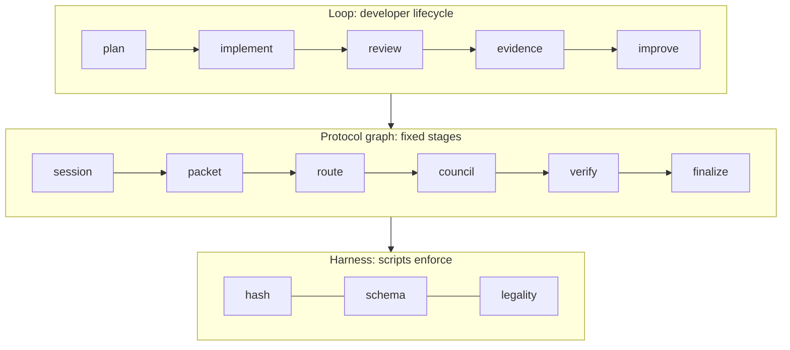
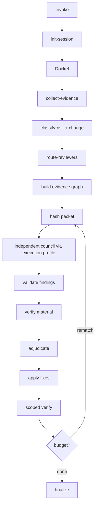

# Yonko Architecture (V3 protocol · harness through 3.8.x)

> An evidence-driven engineering council that plans, reviews, documents and preserves institutional engineering knowledge.


## Intent

**Yonko counters vibe coding** with standards and guardrails: AI may draft and review;
scripts and humans own process and ship authority. Uncriticised AI is the failure mode.

**Chair (Zoro)** is the parent agent and sole writer. Reviewing Yonko: Shanks, Blackbeard, Buggy, Luffy.

Stack this skill uses today:

- markdown skill + prompts
- Task subagents and/or OpenCode CLI seats via execution profiles
- shell scripts for deterministic gates (**harness engineering**)
- fixed protocol control-flow (**protocol-graph engineering**, not a graph runtime)
- bounded rematch / confirmation (**loop engineering**)
- structural schema validation
- thin `/yonko` command

**Diagrams:** [`ENGINEERING-PATTERNS.md`](ENGINEERING-PATTERNS.md) -
harness, fixed protocol graph, nested loops, routing, knowledge loop, and culture contrast.
**Runtimes:** [`docs/EXECUTION-PROFILES.md`](docs/EXECUTION-PROFILES.md) · [`docs/providers/OPENCODE-GO.md`](docs/providers/OPENCODE-GO.md) · [`docs/EVIDENCE-GRAPH.md`](docs/EVIDENCE-GRAPH.md).

**Not** a graph *runtime*. We still do graph *engineering*: a human-designed stage graph
the Chair walks. The Chair does not redraw it mid-session.

## Stack at a glance



## One engine, three adapters

V3 keeps a single shared council engine and varies only what genuinely differs per review
type. There is no generic workflow framework.

```text
Shared Yonko engine
  model config · seats · full-context independence · reviewer lenses
  packet integrity · session creation · events · adjudication priority
  bulletins · Engineering Confidence · human escalation · budgets
├── implementation-review adapter   (V2 behaviour, unchanged)
├── plan-review adapter
└── document-review adapters
    ├── PAP
    ├── PRD
    ├── ADR
    └── technical design
```

Adapters differ in seven places only, declared in `config/review-types.yaml`:
evidence collection, risk semantics, finding schema, loop shape, output artifacts,
verification behaviour, handoff rules.

## Conceptual flows

Full mermaid versions of harness / loops / graphs: [`ENGINEERING-PATTERNS.md`](ENGINEERING-PATTERNS.md).

### Implementation control graph + rematch loop



ASCII (same path):

```text
Invocation
  → init-session (script)                      --type implementation (default)
  → Docket from chat (Chair)
  → collect-evidence (script)
  → classify-risk (script)                      diff-derived
  → route-reviewers (script)                    policy seating
  → build-evidence-graph (script)               impact map + completeness
  → sanitise-and-hash-packet (script)
  → freeze execution profile (script)
  → deterministic checks (exit codes)
  → seat dispatch (invoke-seat; OpenCode = Cursor Task wrapper then --execute)
  → full-scope independent reviews (same hashed packet)
  → validate-artifact --kind findings (script)
  → normalise / dedup (Chair)
  → verify material findings (Task; grouped)
  → adjudicate (Chair; evidence > votes)
  → Chair applies production code
  → scoped verify (exit codes)
  → bulletin → rematch within budget | verdict
  → finalize-session (script)                   SUMMARY + metrics + outcome.json (three-axis)
```

### Three-axis outcome

`finalize-session.sh` writes `outcome.json`:

| Axis | Values |
|------|--------|
| `review_outcome` | `pass` \| `findings` \| `inconclusive` |
| `evidence_completeness` | `complete` \| `incomplete` |
| `deployment_recommendation` | `proceed` \| `proceed_with_caveat` \| `block` |

Do not collapse incomplete evidence into a sole Pass or Fail. See `docs/EVIDENCE-GRAPH.md`.

Plan:

```text
Ticket pasted → Cursor drafts a plan (outside Yonko)
  → init-session --type plan
  → Plan Docket (Chair)
  → collect-plan-evidence (script)              plan + sources + recon + named repos
  → classify-scope-risk (script)                heuristic from stated scope
  → sanitise-and-hash-packet (script)
  → full-scope independent plan reviews (invoke-seat; same packet)
  → validate-artifact --kind plan-findings (script)
  → verify citations (Task)
  → adjudicate (Chair)
  → Chair writes PLAN.revised.md                the plan only, never code
  → required ONE confirmation round after material revision
  → finalize-session → Human runway
  → human approves → PLAN.approved.md           STOP. No implementation.
```

Document:

```text
init-session --type document --artifact <type> --doc-mode create|review
  → Document Docket + adapter checklist (Chair)
  → collect-document-evidence (script)          draft or sources + recon + repos
  → classify-scope-risk (script)
  → sanitise-and-hash-packet (script)
  → create mode only: Chair drafts, then re-collect + re-hash (new version)
  → full-scope independent document reviews (invoke-seat; same packet)
  → validate-artifact --kind document-findings (script)
  → verify claims against code/contracts (Task)
  → adjudicate (Chair)
  → Chair writes <ARTIFACT>.revised.md + review record
  → optional ONE confirmation round
  → finalize-session → Human runway
  → human accepts → <TYPE>.final.md             STOP. No publication.
```

## Mechanical vs prompt

### Mechanically enforced

| Mechanism | Script / hook |
|-----------|----------------|
| Session scaffolding, review type, artifact type, linked-session existence | `init-session.sh` |
| Git evidence + secret path fence | `collect-evidence.sh` |
| Plan evidence presence (plan file required), secret scrub | `collect-plan-evidence.sh` |
| Document evidence presence (draft required in review mode, source required in create mode) | `collect-document-evidence.sh` |
| Diff-derived risk band + reasons + budgets; refuses non-implementation sessions | `classify-risk.sh` |
| Scope-heuristic risk band + reasons + budgets; labels its own basis | `classify-scope-risk.sh` |
| Change classes + reviewer routing (Luffy adapter-gated) | `classify-change.sh`, `route-reviewers.sh` |
| Evidence Graph + completeness (exit 3 blocks seating) | `build-evidence-graph.sh` |
| Packet build, scrub, hash, version - per review type | `sanitise-and-hash-packet.sh` |
| Seat dispatch via frozen profile (Cursor / OpenCode) | `invoke-seat.sh` + `scripts/lib/runtime/` |
| Profile / model-selection doctor | `yonko-doctor.sh` |
| Finding shape per type, verification, verdict shape | `validate-artifact.sh` + `contracts/` |
| Grounding rejection: `n/a` / numeric confidence / `code_inspected` without a path / missing `section` on inaccurate-claim | `validate-artifact.sh` |
| Append-only events | `record-event.sh` |
| Metrics, Engineering Confidence inputs, handoff-artifact presence | `finalize-session.sh` |
| Dotenv / secrets env files | Packet scrub + OpenCode read deny |

### Prompt-orchestrated

Routing between review types, seating order, reviewer independence, single-writer
discipline, adjudication quality, bounded loops, human escalation, actually invoking
scripts, Attack-card honesty, Done-when quality, and whether the revised plan or document
is any good.

The scripts cannot tell that a plan omits a repository. They can only refuse a finding
that claims it without a citation.

## Full-scope review (preserved in every mode)

Every seat gets the identical `packet.md`. Attention biases come from seat prompts /
model-policy or model-selections (profile-dependent). Partitioning the diff, the plan, or
the document across seats is forbidden. Document adapter checklists guide attention; they
do not assign sections. Execution profile chooses runtime/model only - never the evidence.

## Risk semantics - two different things, named differently

| Review type | Script | Basis | Honest limitation |
|---|---|---|---|
| implementation | `classify-risk.sh` | `diff-derived` | reads real changed lines |
| plan / document | `classify-scope-risk.sh` | `heuristic from stated scope and inspected context` | reads only what the artifact says; blind to omissions |

`scope-risk.json` also emits `terms_not_present` - a pure text-presence check, explicitly
labelled a weak signal, never a finding. `omission_hunt_required: true` is passed to
reviewers as an instruction, because omission cannot be classified mechanically.

`/yonko full` is a **floor**: it raises the band to at least high and never downgrades a
critical classification. `/yonko quick` cannot drop below the safety floor when critical
auth / money / isolation / destructive signals fire.

## Adjudication

`prompts/adjudicator.md` - Chair-integrated, shared by all three types.
Priority: deterministic → verification → grounding → severity → Done when → policy.
Votes corroborate only. Grounding requirements differ per type; the priority order does not.

In plan and document review, `apply` means "edit the artifact", never "edit production code".

## Sessions and handoff

One session per phase. Evidence shapes are never mixed in one directory.

```text
plan session → PLAN.approved.md → linked by implementation session (--linked-session)
document session → PAP.final.md / PRD.final.md / ADR.final.md / DESIGN.final.md
```

The implementation Docket references the approved plan, the originating plan session,
deviations from that plan, and the reason for each deviation.

## Observability

Engineering Confidence at the end of every review type, derived from mechanical checks
(packet complete, evidence collected, risk reviewed, verification status, deterministic
checks for implementation, handoff artifact for plan/document) plus Chair-supplied reasons.

`metrics.json` per session and `aggregate-metrics.sh [--type …]` across sessions are
**learning only**. They never feed routing, seating, adjudication, or model ranking.

**Packet principle:** Full relevant context ≠ Full available context.

**No optimisation without evidence:** metrics inform humans; humans change the system.
Planned observational **Engineering Efficiency Report** (Packet / Review / Knowledge) -
see `V4.md`. Do not auto-tune from it.

## Project adapters

`config/project-adapters.yaml` - shipped default (Luffy off).
Optional `config/project-adapters.local.yaml` - local org overlay (gitignored).
Examples under `examples/org-standards/`. Anyone can clone and use; enable Luffy only
if they want. See `SHARE.md`.

## Engineering Evidence Index (V3.1 completion adapter)

Sits beside the three review adapters. It does not seat reviewers or change risk.

```text
Completed Yonko session
  → (opt-in) evidence-index.py candidate     session-local staging
  → human: publish-local --candidate-hash    copy into YONKO_EVIDENCE_REPO
  → rebuild inverted indexes + refresh cache
  → future session: query → retrieval receipt → informed_by (advisory)
```

Canonical store: dedicated local Git checkout (`YONKO_EVIDENCE_REPO`).
`~/.cursor` holds candidates + disposable read cache only.
Records are immutable after canonicalize; outcomes append to `events.jsonl`.
Retrieval is exact inverted indexes + explainable weighted set overlap - not embeddings.

## Evaluation layer (3.9.0, optional / observational)

After finalize writes metrics/confidence/outcome, shared capture emits `evaluation/review-measurement.json` and council-effectiveness. The review-quality ledger is a projection of that measurement. Eval corpus promotion and improvement proposals are human-gated and suggest-only. Does not change Packet, Evidence Graph, routing, seat counts, verifier, or outcome-axis semantics. Details: `docs/EVALUATION-SYSTEM.md`.

