# Consult the Yonko

> An evidence-driven engineering council that plans, reviews, documents and preserves institutional engineering knowledge.


*Plan it. Prove it. Preserve it.*

**Audience:** engineers who will install, run, or maintain this review system  
**Status:** core protocol stable; Evidence Graph + execution profiles (OpenCode Go experimental); packet-anchored workspace discovery; three-axis outcomes; optional Evidence Index / continuous improvement; **evaluation system 3.9.5**
**Invariants:** [`docs/INVARIANTS.md`](docs/INVARIANTS.md) · **Runtime version file:** `VERSION` (maintainers) · **Deltas:** [`CHANGELOG.md`](CHANGELOG.md)

This document describes Yonko as it exists today: an evidence-driven engineering council that plans, reviews, documents, and preserves institutional knowledge. It runs inside Cursor with deterministic shell scripts for evidence, Evidence Graph, and validation. A parent agent - **Chair (Zoro)** - orchestrates review rounds and applies fixes. Reviewer seats run via a frozen **execution profile** (Cursor Tasks and/or OpenCode Go CLI) from one immutable hashed packet. OpenCode live reviewers may extend that evidence through logged read-only workspace discovery.

**Yonko is explicitly a counter to vibe coding.** When AI produces most of the diff,
"generate, glance, ship" stops being an engineering standard. Yonko keeps AI productive
and adds guardrails: shared hashed evidence, independent multi-model review, script
enforcement (risk, seating, schemas, legality), bounded rematch loops, and human authority
over commits, publishes, and protocol changes.

Three review types share one council engine: **plan review** (before code), **implementation review** (diffs), and **document review** (PAP / PRD / ADR / technical design).

If you only need a one-page overview, read [`README.md`](README.md), or [What Yonko is](#1-what-yonko-is), [Review types](#2-review-types), and [Quick start](#3-quick-start).

---

## Table of contents

1. [What Yonko is](#1-what-yonko-is)
2. [Review types](#2-review-types)
3. [Quick start](#3-quick-start)
4. [Core concepts](#4-core-concepts)
5. [System architecture](#5-system-architecture)
5a. [Loops, graphs, and harnesses](#5a-loops-graphs-and-harnesses)
6. [End-to-end workflow](#6-end-to-end-workflow)
7. [The seats (Yonko)](#7-the-seats-yonko)
8. [Risk routing and budgets](#8-risk-routing-and-budgets)
9. [Modes: standard vs autopilot](#9-modes-standard-vs-autopilot)
10. [Evidence Packet and Docket](#10-evidence-packet-and-docket)
11. [Findings, verification, and adjudication](#11-findings-verification-and-adjudication)
12. [Scripts reference](#12-scripts-reference)
13. [Session artefacts](#13-session-artefacts)
14. [Observability](#14-observability)
15. [Project adapters](#15-project-adapters-company-specific-requirements--luffy)
16. [Repository layout](#16-repository-layout)
17. [Installation and sharing](#17-installation-and-sharing)
18. [Hard laws and safety](#18-hard-laws-and-safety)
19. [Known limitations](#19-known-limitations)
20. [Glossary](#20-glossary)
21. [FAQ](#21-faq)
22. [Engineering Evidence Index](#22-engineering-evidence-index)
23. [Continuous Improvement](#23-continuous-improvement)
24. [Evidence Graph](#24-evidence-graph)
25. [Execution profiles and OpenCode Go](#25-execution-profiles-and-opencode-go)
26. [Evidence vs execution separation](#26-evidence-vs-execution-separation)
27. [Prompt prefix stability](#27-prompt-prefix-stability)

---

## 1. What Yonko is

Yonko is a **multi-model code review council** for Cursor.

You work with Cursor as usual. When you want a serious review of uncommitted or branch changes, you invoke Yonko. The parent Cursor agent becomes **Chair (Zoro)**. It:

1. Builds a self-contained **Docket** from the current chat and git state
2. Collects diffs into a hashed **Evidence Packet**
3. Classifies risk, builds Evidence Graph, hashes the packet, freezes an execution profile, and seats reviewers (Cursor Tasks and/or OpenCode)
4. Merges findings using evidence and verification (votes only corroborate)
5. Applies accepted fixes itself
6. Re-seats reviewers until Pass, Deadlock, or Adjourned
7. Never commits or pushes - that stays with the human

Seat names are ceremony. Findings JSON, Attack cards, and verdicts stay cold.

### Design philosophy

```text
Models discover.
Scripts enforce.
Evidence grounds.
Verification proves.
Chair (Zoro) integrates.
Humans decide.
```

Yonko is an **engineering system** and a **standards layer for AI-assisted work**.
AI reviewers are one component - not the product. The product is guardrails: packet,
independence, harness, legality, and human ship authority - the opposite of vibe coding.

Self-observation grows by era: reviewers (V2) → review types (V3) → engineering history
(V3.1) → engineering economics (V4 direction). Always **observe → measure → understand →
optimise**. Never guess → optimise → hope.

**Packet principle:**

```text
Full relevant context ≠ Full available context
```

Maximum relevant context and maximum context are different optimisation problems.
Reviewers need full relevant context, not full available context.

**No optimisation without evidence:** observational metrics inform humans; they must not
silently change seating, packet construction, retrieval, or apply rules. See `V4.md`.

Priority order for decisions:

1. Deterministic evidence (script exits, test results, packet hash)
2. Independent verification
3. Grounding (locus, evidence, reachability, impact)
4. Severity and blast radius
5. Done when checklist
6. Project policy

Reviewer agreement is **corroboration**, not proof.

---

## 2. Review types

V3 has one skill, one council engine, and three explicit review types. There is no fused
automatic pipeline: you start each phase deliberately, and each phase gets its own session.

| Review type | Invoke | Artifact under review | Chair writes | Ends with |
|---|---|---|---|---|
| **Plan** | `/yonko plan` | a drafted implementation plan | `PLAN.revised.md` | `PLAN.approved.md` after you approve |
| **Implementation** | `/yonko`, `/yonko review`, `/yonko full`, `/yonko quick`, `/yonko autopilot` | the branch or working-tree diff | production code fixes | applied fixes + Human runway |
| **Document** | `/yonko document pap\|prd\|adr\|design` | PAP / PRD / ADR / technical design | `<ARTIFACT>.revised.md` | `<TYPE>.final.md` after you approve |

### The intended developer loop

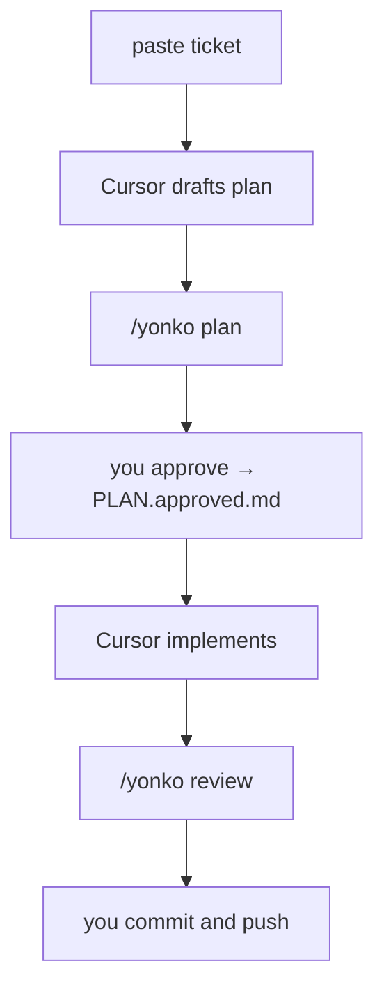

```text
paste Jira ticket
  → Cursor investigates repos and drafts a plan        (normal Cursor work)
  → /yonko plan                                        (council reviews the plan)
  → you read and approve                               → PLAN.approved.md
  → Cursor implements the approved plan                (normal Cursor work)
  → /yonko review                                      (council reviews the diff)
  → you commit and push
```

Plan review **never** continues into implementation. Document review **never** publishes.
Neither ever commits or pushes.

### What is shared vs what is adapted

```text
Shared Yonko engine
  model config · seats · full-context independence · reviewer lenses
  packet integrity · session creation · events · adjudication priority
  bulletins · Engineering Confidence · human escalation · budgets
├── implementation-review adapter   (V2 behaviour, unchanged)
├── plan-review adapter
└── document-review adapters (PAP · PRD · ADR · technical design)
```

Adapters differ in seven places only, declared in `config/review-types.yaml`: evidence
collection, risk semantics, finding schema, loop shape, output artifacts, verification
behaviour, and handoff rules.

### Loops per type

```text
implementation:  review → adjudicate → apply → verify → bounded re-review
plan:            review → revise → risk-triggered single confirmation round → human approval
document:        draft-or-ingest → review → revise → optional single confirmation → human approval
```

### Grounding per type

A concrete code locus is mandatory for implementation findings. It is **not** mandatory for
plan or document findings, because the most valuable findings there concern something
**absent**. Grounding is not relaxed - it moves to `evidence_kind` + `evidence_reference`,
and the validator rejects vague references mechanically.

| Type | Required grounding fields | Validator rejects |
|---|---|---|
| implementation | `locus.repository`, `locus.path`, `evidence`, `reachability`, `impact` | missing locus, `n/a`-class evidence, numeric confidence |
| plan | `evidence_kind`, `evidence_reference`, `production_consequence` | `n/a`-class references, `code_inspected` with no path, `missing-repository`/`missing-contract` without `missing_element`, `architectural-assumption` without `assumption_challenged` |
| document | `evidence_kind`, `evidence_reference`, `impact` | `n/a`-class references, `code_inspected` with no path, `inaccurate-claim`/`internal-contradiction` without `section`, `missing-section` without `missing_section` or `section` |

`evidence_kind` for plan review is one of `plan_section`, `code_inspected`,
`contract_inspected`, `document_inspected`. Document review adds `document_section` and
`source_material`.

### Plan finding categories

missing repository · missing contract · architectural assumption · migration · rollout ·
rollback · deploy order · concurrency and failure mode · compatibility · testing strategy ·
unnecessary complexity · ownership and unresolved decisions · security

Plan review also applies leaf-contract closure. Reviewers must follow material lifecycle,
identity, mapper, retry, persistence, and external-effect steps to the terminal leaf. A plan
cannot close a finding with `atomic`, `adopt`, `merge`, `retry`, or similar orchestration
wording alone. It must name exact records and key encoding, ownership predicates, atomic
boundaries, partial-failure and retry-exhausted outcomes, identity propagation, and the
terminal-effect tests that prove the behaviour.

### Document finding categories

inaccurate claim · unsupported claim · missing section · ambiguous requirement ·
unresolved decision · internal contradiction · implementation risk · operational gap ·
missing stakeholder concern

### Document adapters

Checklists live in `config/document-adapters.yaml`. They guide attention and define
expected sections. They do **not** divide the artifact between reviewers - every reviewer
still assesses the whole thing.

| Artifact | Reviewed for |
|---|---|
| **PAP** | current-state accuracy, problem clarity and evidence, genuine comparison of alternatives, service boundaries and ownership, APIs/contracts/events/data flows, failure modes, migration, rollout and rollback, deployment order, unresolved decisions, implementation readiness |
| **PRD** | problem and user clarity, business outcome, scope and non-goals, testable requirements, success measures, dependencies and constraints, edge cases and failure experience, feasibility, accidental over-prescription of implementation, consistency across product/engineering/QA |
| **ADR** | decision context, alternatives, trade-offs, rationale, consequences, reversibility, assumptions, future constraints |
| **Technical design** | technical correctness, completeness, architecture and boundaries, contracts and data flow, failure behaviour, security and performance, testing, observability, migration/rollout/rollback, implementability |

### Document create mode: the two-phase packet

In `create` mode there is no draft to review at first. The Chair builds a packet from the
source material, drafts the artifact, then **re-collects evidence and re-hashes the packet**
so `packet_version` increments and the council reviews a document that actually exists.
Reviewers never review a document that does not exist.

### Sessions and handoff

One session per phase. Evidence shapes are never mixed in one directory.

```text
plan session → PLAN.approved.md → linked by implementation session (--linked-session)
document session → PAP.final.md / PRD.final.md / ADR.final.md / DESIGN.final.md
```

The implementation Docket references the approved plan, the originating plan session,
deviations from that plan, and the reason for each deviation.

### Breaking rename in V3

`/yonko plan` used to mean "force the high implementation route with an inline plan author
and challenger". It now means real plan review.

| Want | V2 | V3 |
|---|---|---|
| four reviewers on a diff | `/yonko plan` | `/yonko full` |
| review a plan before coding | (did not exist) | `/yonko plan` |

`classify-risk.sh --force plan` now exits with an error pointing at `--force full`.
High and critical implementation routes no longer run an inline plan author or challenger;
`risk.json` emits `recommend_plan_review`, which the Chair reports in the Human runway and
never acts on silently.

---

## 3. Quick start

### Prerequisites

- Cursor with Agent mode and the **Task** tool (subagents + model allowlist)
- Local clones of the repositories under review
- Shell access for scripts under `~/.cursor/skills/the-yonko/scripts/`
- Optional: your company's engineering-requirements skill if you want Luffy (see `SHARE.md`)
- **Recommended:** [OpenCode Go](https://opencode.ai/docs/go/) +
  `scripts/set-execution-profile.sh --profile cursor-opencode-go` then `/yonko doctor`
  (Cursor Chair/Shanks + Go grind seats; many council rounds per Go 5h/$12 window)

### Invoke

In chat, say one of:

| Phrase | Review type / mode |
|--------|--------------------|
| `Consult the Yonko` | Implementation, standard |
| `Yonko autopilot` | Implementation, autopilot |
| `/yonko` | Implementation, standard (if command registered) |
| `/yonko review` | Implementation, standard |
| `/yonko autopilot` | Implementation, autopilot |
| `/yonko quick` | Implementation, force lower route (safety floor still applies) |
| `/yonko full` | Implementation, force high route (floor - never downgrades critical) |
| `/yonko doctor` | Validate active execution profile / model resolution |
| `/yonko plan` | **Plan review** of a drafted implementation plan |
| `/yonko document pap\|prd\|adr\|design` | **Document review** or creation |
| `review this plan with the Yonko` | Plan review |
| `Yonko review this PRD` | Document review |

### What you should see

1. Ceremony: seats announced with model slugs and risk band
2. Short Docket summary (`Log Pose locked.`)
3. Reviewers seated via frozen execution profile (`invoke-seat` → Cursor Tasks and/or OpenCode),
   named `Shanks`, `Blackbeard`, `Buggy`, `Luffy` (when applicable)
4. Round bulletins after each merge
5. Chair applying fixes when rules allow
6. Final Verdict with **Engineering Confidence** first, then Human runway
7. Session files under `~/.cursor/yonko-sessions/<id>/`

### What you do

- Interrupt with `Yonko halt` / adjourn if needed
- Answer only irreducible product/policy questions
- Commit and push yourself when ready

---

## 4. Core concepts

| Term | Meaning |
|------|---------|
| **Chair (Zoro)** | Parent Cursor agent. Only writer. Final decision. Runs scripts, applies fixes, posts bulletins. |
| **Yonko / seats** | Read-only advisors (Cursor Tasks and/or OpenCode). Never edit the tree. |
| **Docket** | Intent document mined from chat + git (goal, Done when, golden path, constraints). |
| **Evidence Packet** | Docket + labeled diffs for every in-scope repo. Identical for every seat. |
| **Packet hash** | SHA-256 of the packet bytes. Detects stale packets. |
| **Finding** | Grounded defect hypothesis with locus, evidence, reachability, impact. |
| **Note** | Deploy-order reminder (e.g. lockfile after model CI). Never a Remand. |
| **Attack card** | Mandatory adversarial checklist; required even when findings are empty. |
| **Coverage receipt** | Each seat lists every DIFF label reviewed. |
| **Adjudication** | Chair decides apply / hold / drop / note using evidence priority. |
| **Verification** | Separate check that confirms or rejects material findings. |
| **Engineering Confidence** | End-of-run HIGH / MEDIUM / LOW with reasons, on every review type. |
| **Review type** | `implementation`, `plan`, or `document`. Set at `init-session.sh`; drives evidence, contract, loop, and output. |
| **Adapter** | The per-type (and per-artifact) configuration in `config/review-types.yaml` and `config/document-adapters.yaml`. |
| **Risk basis** | `diff-derived` for implementation, `heuristic from stated scope and inspected context` for plan and document. Never presented as equivalent. |
| **Linked session** | A plan session id recorded on a later implementation session, connecting the phases. |
| **Handoff artifact** | `PLAN.approved.md` or `<TYPE>.final.md`. Written only after human approval. |
| **Evidence Graph** | Deterministic change-impact map (symbols, reachability, completeness) built before packet hash. Scripts own edges. |
| **Execution profile** | Which runtime/model runs each seat against the already-hashed packet. Does not change evidence. |
| **Model selections** | Single source of truth for hybrid-profile model IDs (`config/model-selections.json`). |
| **OpenCode seat** | Independent Command Line Interface (CLI) reviewer. Starts from the same packet, may use frozen read-only workspace discovery, records a discovery ledger, returns findings only, and has a baseline-delta worktree guard. |

---

## 5. System architecture

### 5.1 Component view

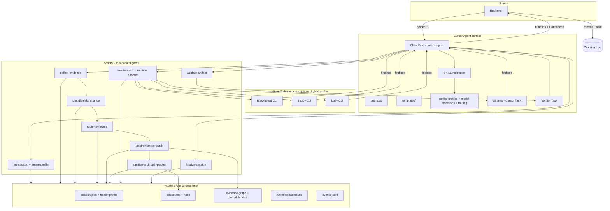

Note: under `cursor-standard`, Blackbeard/Buggy/Luffy also run as Cursor Tasks. Under
`cursor-opencode-go`, those three seats use OpenCode CLI against the **same** packet hash.
Normal live reviews use `packet_plus_workspace_read`: the packet is authoritative,
then the reviewer may read/search declared repositories to resolve gaps. Each seat
writes `runtime/<seat>/repository-exploration.json`. Frozen-packet replay forces
`packet_only`; full-pipeline replay preserves workspace discovery.
Plan/document Chair write targets remain session artifacts, never production code.

### 5.2 Trust boundary: mechanical vs prompt

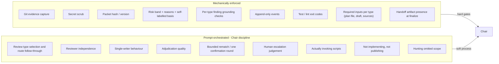

**Rule for maintainers:** only claim "enforced" when a script, hook, or exit code guarantees it. Do not describe Chair discipline as if Cursor were executing a graph engine.

The sharpest example of this boundary is omitted scope. `classify-scope-risk.sh` can tell
you that the word "rollback" does not appear in a plan. It cannot tell you whether a
rollback step is genuinely required. The first is a script check; the second is a reviewer
duty, and the prompts say so explicitly.

### 5.3 Data flow for one round

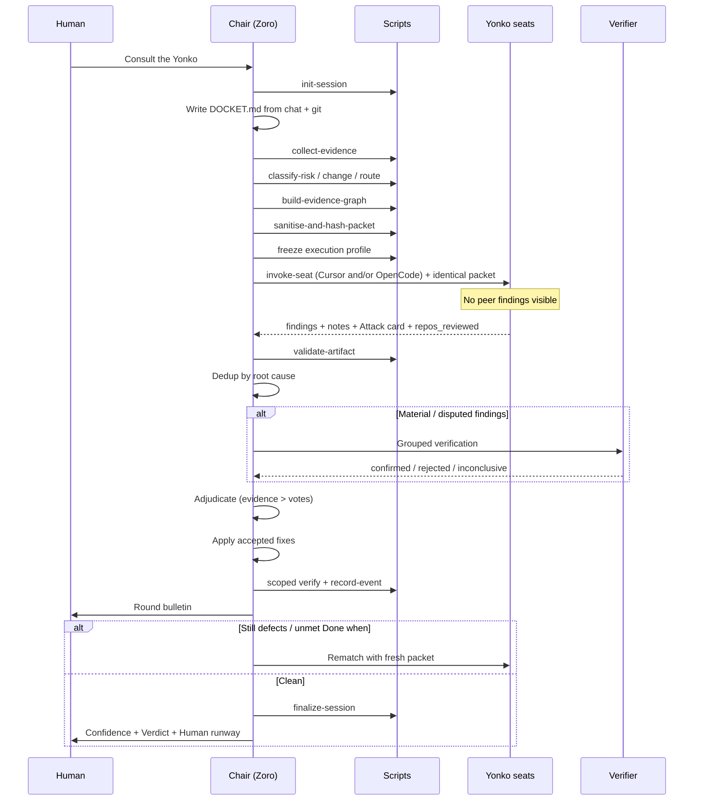

---

## 5a. Loops, graphs, and harnesses

Three disciplines the protocol uses:

| Discipline | In Yonko | Refuse |
|------------|----------|--------|
| **Harness engineering** | Scripts + contracts wrap model judgement | "The model will remember the rules" |
| **Protocol-graph engineering** | Fixed stage graph the Chair walks | Runtime graph rewrite / self-planning agents |
| **Loop engineering** | Declared rematch + confirmation budgets | Unbounded keep-going loops |

**Diagram set:** [`ENGINEERING-PATTERNS.md`](ENGINEERING-PATTERNS.md) (Mermaid renders on GitHub; Cursor preview may show source).

### Developer lifecycle loop

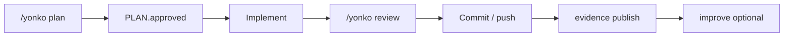

### Harness around judgement

```mermaid
flowchart TB
  subgraph scripts["Harness"]
    collect --> classify --> route --> graph --> hash --> invoke --> validate --> legality
  end
  hash --> council[Council judgement]
  council --> validate
  validate --> verify[Verifier]
  verify --> chair[Chair apply]
  chair --> legality
```

### Implementation rematch loop

```text
review → adjudicate → apply → verify → bounded re-review
```

Budgets live in `config/review-types.yaml` / risk policy. Deadlock or Adjourned when the
budget is exhausted with material findings still open.

### Fixed protocol graph vs graph runtime

```text
Yonko:     human designs graph → Chair walks it → legality fails closed
Not Yonko: model invents stages mid-flight → hard to audit → soft rubber-stamps
```

Also see [`ARCHITECTURE.md`](ARCHITECTURE.md) and the culture contrast in [`ENGINEERING-PATTERNS.md`](ENGINEERING-PATTERNS.md).

---

## 6. End-to-end workflow

### 6.1 Chair checklist - implementation review (canonical)

```text
0. Mode + optional force route from invoke
1. init-session.sh                                  # --type defaults to implementation
2. Mine chat → DOCKET.md
3. collect-evidence.sh
4. classify-risk.sh
4b. classify-change.sh [--advisory closed-enum-tags]
4c. route-reviewers.sh
4d. build-evidence-graph.sh                      # impact graph + completeness (exit 3 blocks seating)
5. Context pack lint → sanitise-and-hash-packet.sh   # pins change-classes + routing + graph
6. Deterministic checks if applicable
7. Freeze execution profile → invoke-seat / Task per routing.json (identical packet; Cursor and/or OpenCode)
8. validate-artifact.sh on findings
9. Normalise / dedup by root cause
10. Verify material findings if routing.require_verifier or route requires
11. Adjudicate (evidence > votes)
12. Chair applies accepted fixes only
13. Scoped verify → record-event
14. Round bulletin
15. Rematch within budget | Pass | Deadlock | Adjourned
16. Engineering Confidence + finalize-session.sh
```

`/yonko explain` runs `scripts/workflow/explain.py` (workflow legality + Selected reviewers).

If `risk.json` shows `recommend_plan_review: true`, say so in the Human runway. Do not
start a plan review inside this session.

### 6.1a Chair checklist - plan review

```text
0. The human pasted a ticket; Cursor drafted a plan in this chat (outside Yonko)
1. Save the plan (PLAN.draft.md) and write RECON.md: the paths and symbols you opened
2. init-session.sh --type plan [--linked-session …]
3. Write the Plan Docket (templates/plan-review.md)
4. collect-plan-evidence.sh --plan … [--source …] [--recon …] [--repo …]
5. classify-scope-risk.sh
6. sanitise-and-hash-packet.sh
7. Freeze profile → seat reviewers per scope band (prompts/plan-reviewers.md), identical packet
8. validate-artifact.sh --kind plan-findings
9. Normalise / dedup by root cause
10. Verify material findings (the verifier re-opens the citations)
11. Adjudicate (evidence > votes)
12. Chair writes PLAN.revised.md - the plan only, never code. Record
    `artifact_revised` with `accepted_medium_or_higher` and `material_leaf_revision`.
13. Round bulletin; record artifact_revised
14. Run ONE full confirmation round when an accepted medium-or-higher finding or material
    lifecycle / identity / transaction / retry / mapper / persistence / external-effect
    revision exists. Re-hash the revised plan, use the same seats, re-open terminal leaves,
    and invent new hostile cases. Record `reviewers_seated` with
    `confirmation_round:true`. Do not only re-check prior finding ids.
15. Engineering Confidence + finalize-session.sh
16. Human runway: ask for approval. STOP.
17. On approval: PLAN.approved.md. Implementation is a separate session.
```

### 6.1b Chair checklist - document review

```text
1. init-session.sh --type document --artifact pap|prd|adr|design --doc-mode create|review
2. Write the Document Docket, pasting the adapter checklist for this artifact type
3. collect-document-evidence.sh [--draft …] [--source …] [--recon …] [--repo …]
4. classify-scope-risk.sh
5. sanitise-and-hash-packet.sh
6. CREATE MODE ONLY: draft <TYPE>.draft.md, then re-run collect-document-evidence.sh
   --mode review --draft … and sanitise-and-hash-packet.sh (new version, new hash)
7. Freeze profile → seat reviewers per scope band (prompts/document-reviewers.md), identical packet
8. validate-artifact.sh --kind document-findings
9. Normalise / dedup; verify claims against code and contracts; adjudicate
10. Chair writes <ARTIFACT>.revised.md plus the review record:
    decisions, assumptions, open questions, rejected findings, remaining risks
11. Round bulletin; at most ONE confirmation round
12. Engineering Confidence + finalize-session.sh
13. Human runway: ask for acceptance. STOP.
14. On acceptance: <TYPE>.final.md. Publishing is the human's call.
```

### 6.2 Soft stop conditions

| Condition | Verdict |
|-----------|---------|
| No high/medium defects + Attack cards + Done when met/n/a | **Pass** |
| Plan: material revision complete and required confirmation round is Content | **Pass** (still awaiting human approval) |
| Document: revision complete, one confirmation round used at most | **Pass** (still awaiting human approval) |
| Split holds remain after breaker + Chair evidence pass as product ambiguity | **Deadlock - human / product** |
| Same defect after two applies (thrash) | **Deadlock - human** |
| Scoped verify still red after Chair retry | **Deadlock - human** |
| User halt / adjourn | **Adjourned** |
| Round ≥ 5 still remanding | Restless nudge; continue unless halted |

### 6.3 Deadlock path

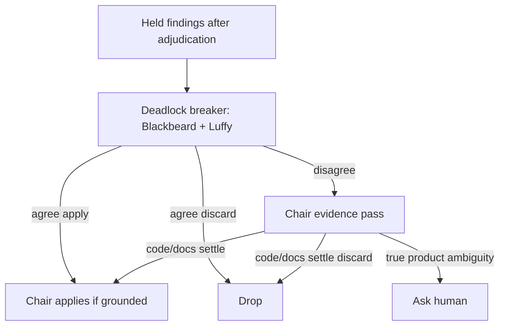

Chair must exhaust chat → ticket/docs → code/tests → safe read-only DB/logs before asking the human.

---

## 7. The seats (Yonko)

### 7.1 Roster

Attention biases are fixed. **Models and runtimes follow the active execution profile**
(§7.3). **Recommended profile:** `cursor-opencode-go`. Resolution fallback when no marker:
`cursor-standard`.

| Seat | Attention bias (not a boundary) |
|------|----------------------------------|
| **Chair (Zoro)** | Parent agent. Final decision. Only writer. Docket, scripts, adjudication, apply/revise, bulletin |
| **Shanks** | Contracts, compatibility, requirements, API shapes, auth boundaries |
| **Blackbeard** | Correctness, concurrency, retries, golden-path parity, side-effect leaves |
| **Buggy** | Operational chaos, unusual inputs, ticket-omitted cases |
| **Luffy** | Company-specific requirements (optional; adapter-gated; high/critical or `/yonko full`) |

| Profile | Typical models when seated |
|---------|----------------------------|
| `cursor-opencode-go` (**recommended**) | Auto + Grok (Cursor); DeepSeek V4 **Flash** + Luna + Qwen ([OpenCode Go](https://opencode.ai/docs/go/)) |
| `cursor-standard` (fallback) | Allowlist via `model-policy.yaml` |

**Chair (Zoro)** is the parent agent with hands. Reviewing Yonko advise; they do not edit.
Do not spawn a separate Zoro Task.

### 7.2 Non-negotiable independence rules

Every seated reviewer must:

1. Receive the **same** neutral Evidence Packet
2. Review the **complete** change and **every** affected repository
3. Search for defects in **every** category
4. Never see another reviewer's findings during round one
5. Be free to report outside their specialty

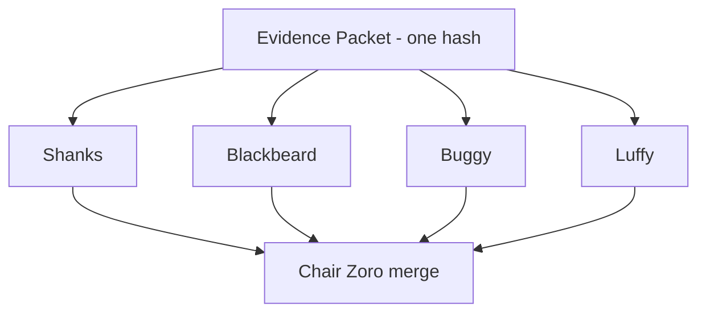

**Forbidden:** partitioning the FE diff to Shanks and the Java diff to Blackbeard. That invalidates the review.

**Allowed:** attention bias ("Shanks, pay extra attention to contracts") while still reviewing everything.

### 7.3 Model selection (two layers)

**Layer A - Cursor-only profiles** (`cursor-standard`, `cursor-max`): resolve from the live
Task allowlist via `config/model-policy.yaml` (families + prefer lists). Do not hardcode
version slugs in prompts.

**Layer B - Hybrid profile** (`cursor-opencode-go`, **recommended**): model IDs come only from
`config/model-selections.json`. Adapters never choose substitutes. See §25 for Go cost/volume.

```text
cursor-opencode-go panel (when that profile is active)
  Chair      → Cursor Auto              (orchestration; variable)
  Shanks     → Cursor Grok              (never Auto)
  Blackbeard → opencode-go/deepseek-v4-flash
  Buggy      → opencode-go/gpt-5.6-luna
  Luffy      → opencode-go/qwen3.7-plus  (escalation only)
```

Optional edits in `model-selections.json` only (no runtime auto-switch):

- Blackbeard → `opencode-go/deepseek-v4-pro` (peak SWE depth when Flash is too shallow)
- Luffy → `opencode-go/kimi-k3` (`luffy_kimi` alternate; historically timed out at 600s on plan packets)

Missing or ambiguous OpenCode models **fail closed**. Never silently substitute Flash for
Pro, Luna for Qwen, or DeepSeek for Luffy's model.

For Cursor-only defaults (policy file), the historical prefer order remains:

1. Shanks: `gpt*` - luna > terra > sol
2. Blackbeard: Cursor-hosted `deepseek*` else `claude*` (never silent Grok/Composer)
3. Buggy: `grok*` required
4. Luffy: `qwen*` then composer (Kimi last) before another GPT/Claude
5. Chair parent on `cursor-standard`: prefer Composer when Auto is not pinned

Escalate Cursor seats to Opus / Sol / thinking-high only on human request or Remand rematch.
Never BYOK for Yonko seats.

When Cursor Claude/GPT Tasks fail under Layer A (`Couldn't start`, API capped), Chair may
Shell-run `scripts/run-external-seat.sh` (Claude Code / Codex) against the same hashed
packet - never ask the human to run CLIs, never silent Grok-as-Blackbeard.

Task UI `description` must start with `Shanks` / `Blackbeard` / `Buggy` / `Luffy`.
OpenCode wrapper tiles should use `dispatch.task_description` (includes real model id;
Cursor badge still shows the wrapper model).

Detail: [`docs/EXECUTION-PROFILES.md`](docs/EXECUTION-PROFILES.md),
[`docs/providers/OPENCODE-GO.md`](docs/providers/OPENCODE-GO.md).

### 7.4 Luffy specifics

Luffy is the **house-rules seat**. Shanks / Blackbeard / Buggy apply universal
engineering lenses. Luffy applies **your company's** requirements (service
boundaries, ship/done policy, internal review rules) from the adapter skill
paths. Without those paths he stays abroad; the rest of the council still runs.

- Seated only when risk band is high/critical (or `/yonko full`) **and** a project adapter
  enables Luffy (`luffy.enabled: true`)
- When seated, Luffy follows the adapter's `skills` / `adversarial_rule` paths. Everyday
  local pre-push or CI review bots are a separate layer - do not conflate them with Luffy.
- Findings are **not** automatically correct and must **not** be silently dropped
- Same grounding and verification path as every other seat
- If Qwen is unavailable under `cursor-opencode-go`, fail closed - do not substitute

---

## 8. Risk routing and budgets

Risk is a **heuristic band with reasons**, not a fake precision score like "82".

There are two classifiers, and they are not interchangeable.

| Classifier | Used by | Basis | Blind to |
|---|---|---|---|
| `classify-risk.sh` | implementation | `diff-derived` - reads real changed lines | nothing in the diff; it sees the whole change |
| `classify-scope-risk.sh` | plan, document | `heuristic from stated scope and inspected context` | **omissions** - it only reads what the artifact says |

Both write the basis into `session.json` and the risk JSON so a band can never be presented
as stronger evidence than it is.

### 8.1 Bands - implementation

| Band | Reviewers | Verify | Target Task calls |
|------|-----------|--------|-------------------|
| trivial | 1 | no | 1 |
| low | 2 (different families) | no | 2 |
| medium | 3 | disputed / material | 3-5 |
| high | 4 + Luffy | high/critical | 8-10 |
| critical | 4 + Luffy | high/critical | 10-12 |

High and critical no longer run an inline plan author and challenger. They emit
`recommend_plan_review: true` for the Human runway instead.

### 8.1a Bands - plan and document

| Band | Reviewers | Verify | Target Task calls | Confirmation rounds |
|------|-----------|--------|-------------------|---------------------|
| trivial | 2 | no | 2 | 1 max |
| low | 2 (different families) | no | 3 | 1 max |
| medium | 3 | disputed / material | 4 | 1 max |
| high | 4 + Luffy | high/critical | 6 | 1 max |
| critical | 4 + Luffy | high/critical | 7 | 1 max |

### 8.1b The `terms_not_present` signal

`classify-scope-risk.sh` also emits `terms_not_present`: a plain text-presence check for
migration, rollout, rollback, deploy order, testing, observability, failure modes,
compatibility, and ownership. It is passed to reviewers as a **weak hint**, explicitly
labelled as term absence only, never as a finding. Reviewers decide whether the step is
genuinely required. `omission_hunt_required: true` is always set.

### 8.2 How implementation classification works

`classify-risk.sh` inspects collected patches and raises the band when signals match, for example:

- **critical:** auth, money/billing/invoice, customer isolation, destructive rehome/delete patterns
- **high:** OpenAPI/API/GraphQL, migrations, multi-repo, SQS/SNS/async publish paths
- **medium:** large diffs, prod+test both changed
- **low / trivial:** small or docs-like diffs

### 8.3 Safety floor

`/yonko quick` must **not** drop below the safety floor when critical auth / money / isolation / destructive signals fire.

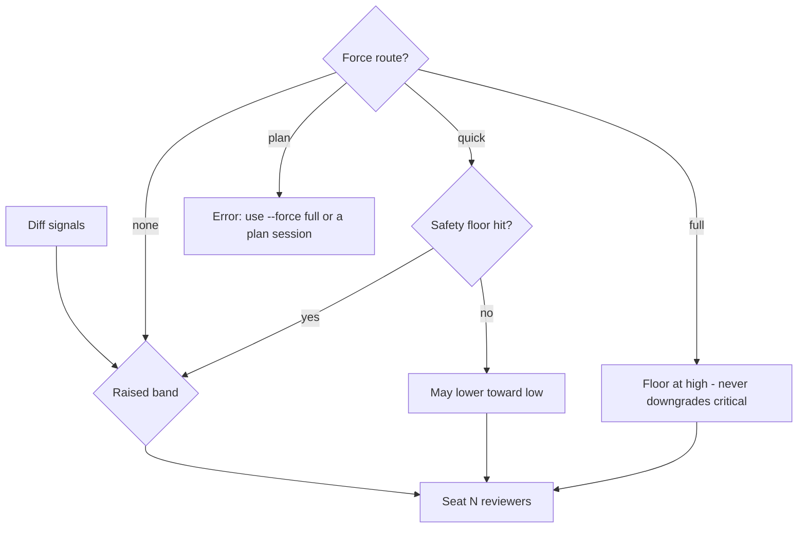

---

## 9. Modes: standard vs autopilot

| | Standard | Autopilot |
|--|----------|-----------|
| Invoke | `Consult the Yonko`, `/yonko` | `Yonko autopilot`, `/yonko autopilot` |
| Auto-apply | Unanimous **accepted** defects only | Majority with Blackbeard or Luffy in the majority |
| Style nits | Drop | Drop |
| Human | Asked for product ambiguity / Deadlock / thrash | Interrupt-only for flow; still asked for product ambiguity |
| Deadlock breaker | Once, then Chair evidence pass | Same |

Ungrounded findings are dropped even if unanimous.

Autopilot changes the **apply gate only**. It never grants permission to commit, push,
publish, or continue from plan review into implementation.

---

## 10. Evidence Packet and Docket

### 10.1 Why the packet exists

Subagents do not see the parent chat. Without a packet they invent context. The Chair must ship a self-contained Docket plus diffs.

### 10.2 Packet structure

```text
=== YONKO DOCKET ===
...
=== REPOS ===
...
=== DIFF LABELS (must appear in repos_reviewed) ===
...
=== DIFF MAP ===
...
=== DIFF: frontend/app ===
...
=== DIFF: services/example-service ===
...
```

Build via:

```bash
scripts/sanitise-and-hash-packet.sh --session "$SESSION" --docket "$SESSION/DOCKET.md"
```

The same script builds all three packet shapes; it reads `review_type` from `session.json`.
Implementation packet bytes are unchanged from V2 (verified byte-for-byte against a
reimplementation of the V2 assembly), so historical hashes remain comparable.

### 10.2a Plan packet structure

```text
=== YONKO DOCKET ===
=== REVIEW TYPE ===
=== REPOSITORIES NAMED IN PLAN ===
=== TERMS NOT PRESENT IN ARTIFACT (weak signal only) ===
=== IMPLEMENTATION PLAN UNDER REVIEW ===
=== SOURCE MATERIAL: ticket.md ===
=== RECONNAISSANCE NOTES (paths and symbols already inspected) ===
```

### 10.2b Document packet structure

```text
=== YONKO DOCKET ===
=== REVIEW TYPE ===
=== REPOSITORIES INSPECTED ===
=== TERMS NOT PRESENT IN ARTIFACT (weak signal only) ===
=== SECTION MAP (line / level / heading) ===
=== PAP UNDER REVIEW ===
=== SOURCE MATERIAL: notes.md ===
=== RECONNAISSANCE NOTES (paths and symbols already inspected) ===
```

The `SECTION MAP` gives every heading a line number so document findings can cite an exact
section rather than a vague impression.

### 10.3 Context pack lint (before seating)

Required:

- Done when has at least one concrete item
- Diff map for every in-scope dirty repo
- Labeled DIFF block (or explicit omit reason) for each
- Expected DIFF labels listed
- Secrets excluded
- Mode announced
- Deploy-order / out-of-scope fences present
- Golden-path excerpt if a golden path was named

### 10.4 Secrets

- Never put dotenv / secrets env files or secret values in the packet
- `collect-evidence.sh` and `sanitise-and-hash-packet.sh` scrub secret-looking paths and assignment lines

---

## 11. Findings, verification, and adjudication

### 11.1 Finding contract

Each defect finding should include:

| Field | Purpose |
|-------|---------|
| `id` | Stable id (`S1`, `Y1`, `Lf1`, …) |
| `reviewer` | `shanks` / `blackbeard` / `buggy` / `luffy` |
| `category` | e.g. correctness, auth, side-effect |
| `severity` | critical / high / medium / low |
| `title` / `claim` | What is wrong |
| `locus` | repository + path (+ optional symbol) |
| `evidence` | Diff hunk, path+symbol, or Docket quote |
| `reachability` | How a real path hits this |
| `impact` | What breaks |
| `confidence` | `low` / `medium` / `high` only (no numeric fake precision) |

Reject findings that lack evidence, locus, reachability, or impact.

### 11.1a Plan and document finding contracts

Plan findings drop the mandatory locus and add:

| Field | Purpose |
|-------|---------|
| `evidence_kind` | `plan_section` / `code_inspected` / `contract_inspected` / `document_inspected` |
| `evidence_reference` | the exact plan statement, or a path+symbol actually opened, or a contract read |
| `production_consequence` | what breaks in production if the plan ships as written |
| `missing_element` | the repo, contract, step, test, or decision that is absent |
| `assumption_challenged` | the plan assumption being disputed |
| `recommended_plan_change` | minimal change to the **plan**, not to code |
| `locus` | optional |

Document findings use `evidence_kind` (adding `document_section` and `source_material`),
`evidence_reference`, `impact`, `section`, `missing_section`, and `recommended_change`.

Validate with the kind that matches the review type:

```bash
scripts/validate-artifact.sh --kind findings          --file findings.json   # implementation
scripts/validate-artifact.sh --kind plan-findings     --file findings.json   # plan
scripts/validate-artifact.sh --kind document-findings --file findings.json   # document
```

For plan and document sessions, wrap the array in the matching key (`plan_findings` /
`document_findings`) so `finalize-session.sh` counts findings correctly.

### 11.2 Notes vs findings

| Put in findings | Put in notes |
|-----------------|--------------|
| Logic bugs, auth holes, missing adversary tests | Pending `gradle.lockfile` bumps |
| Wrong API behaviour in the YAML/code itself | Wait for unpublished model client CI |
| Bad lockfile churn that is already in the diff | "Won't compile until deploy order completes" |

Notes never Remand. Pass is allowed with deploy-order notes listed.

### 11.3 Verification over voting

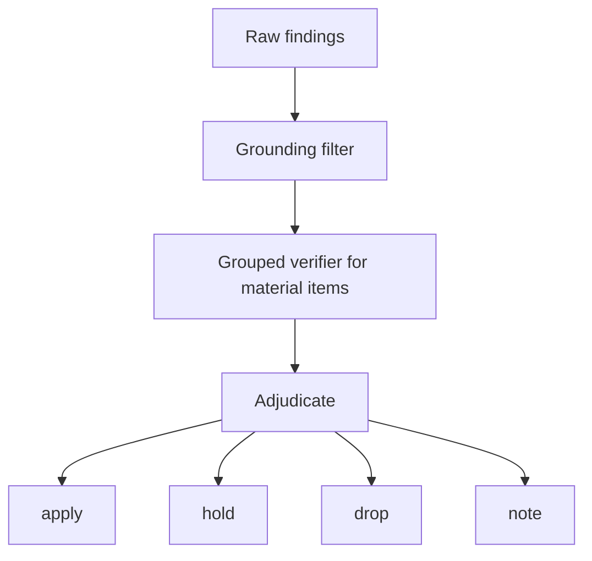

Adjudication priority (never invert):

1. Deterministic evidence
2. Verification outcomes
3. Grounding
4. Severity
5. Done when
6. Project policy

Deduplicate only on the **same root cause**. Do not flatten distinct failure modes (invalid state vs unbounded retry vs concurrent overwrite).

### 11.4 Attack card

Every seat returns an Attack card even when `findings: []`. Rubber-stamp empty reviews are forbidden.

| Review type | Attack card rows cover |
|---|---|
| implementation | golden-path parity, sibling/shared-parent, guarded delete, presence shapes, side-effect leaf, external identity, **reconstructed outbound preserves sibling inbound fields**, **vendor/runtime event shape vs fixture**, **vendor doc / sample cite**, **hostile re-review of preserve/serialize fix**, leaf-effect tests |
| plan | golden path the plan sits beside, repos/consumers named vs reached, unstated contracts and version bumps, assumption verified against code, migration, deploy order, rollout/rollback, concurrency and failure modes, compatibility, testing strategy, unnecessary complexity, unresolved decisions |
| document | adapter checklist applied, claims verified against code, unsupported claims, required sections present, internal contradictions, ambiguity, failure modes and operations, security/performance/observability, unresolved decisions, stakeholder gaps, implementability |

`n/a` on a row is acceptable only with a stated reason. A blank row is a failed review.

### 11.5 Three-axis outcome (do not collapse)

Protocol stop labels (`Pass` / `Remand` / `Deadlock` / `Adjourned`) are not the whole story.
`finalize-session.sh` also writes **`outcome.json`** with three independent axes plus
presentation gates:

| Axis / field | Values | Meaning |
|------|--------|---------|
| `review_outcome` | `pass` \| `findings` \| `inconclusive` | Validated defects only |
| `evidence_completeness` | `complete` \| `incomplete` | Evidence Graph / Index coverage |
| `deployment_recommendation` | `proceed` \| `proceed_with_caveat` \| `block` | Ship advice from both axes |
| `clean_pass_allowed` | `true` \| `false` | False when incomplete, especially unresolved `operational_side_effects` or `cross_repository_consumers` |
| `presentation.headline` | string | Never sole `Pass` when `clean_pass_allowed` is false |

Example that must stay distinct:

```text
review_outcome: pass
evidence_completeness: incomplete   # e.g. unresolved external consumers
deployment_recommendation: proceed_with_caveat
clean_pass_allowed: false
presentation.headline: Pass with unresolved evidence (cross_repository_consumers, ...)
```

Never report that as a sole green `PASS`, push-ready, or clean pass. Chair confidence is
clamped to `confidence_ceiling`. Same fields are embedded on `metrics.json` / `SUMMARY.md`.
Return/DTO population changes stage in-repo readers into packet `=== IMPACT READERS ===`.
Detail: [`docs/EVIDENCE-GRAPH.md`](docs/EVIDENCE-GRAPH.md) (Complete vs incomplete).

---

## 12. Scripts reference

Skill scripts live at:

```text
~/.cursor/skills/the-yonko/scripts/
```

| Script | Used by | Role |
|--------|---------|------|
| `init-session.sh` | all | Create `session.json`, `events.jsonl`, changelog/bulletin stubs. Accepts `--type`, `--artifact`, `--doc-mode`, `--linked-session`. Prints session path on stdout. |
| `collect-evidence.sh` | implementation | Gather git status/diff per repo; write `evidence/`; scrub secret paths. |
| `collect-plan-evidence.sh` | plan | Ingest the plan file, source material, reconnaissance notes, and git context for every named repository. |
| `collect-document-evidence.sh` | document | Ingest the draft (review mode) or source material (create mode), build `SECTION_MAP.txt`, capture inspected repositories. |
| `classify-risk.sh` | implementation | Emit `evidence/risk.json` (`diff-derived`). Refuses plan and document sessions. |
| `classify-scope-risk.sh` | plan, document | Emit `evidence/scope-risk.json` (heuristic) plus `terms_not_present`. |
| `classify-change.sh` | implementation | Emit `evidence/change-classes.json` from `routing-policy.yaml` signals (+ optional closed-enum `--advisory`). |
| `route-reviewers.sh` | implementation | Emit `evidence/routing.json` (union of band baseline + class seats; Luffy adapter-gated). |
| `build-evidence-graph.sh` | implementation (plan/doc optional) | Deterministic Evidence Graph + completeness gates. Exit 3 if seating blocked. |
| `evaluate-evidence-completeness.sh` | any with graph | Re-run completeness gates / waiver. |
| `sanitise-and-hash-packet.sh` | all | Build `packet.md`, `packet.meta.json`, bump packet version, SHA-256 hash. |
| `invoke-seat.sh` | all (hybrid) | Provider-neutral seat dispatch. Default for OpenCode: write Cursor Task dispatch only. Wrapper Task re-runs with `--execute` to run the OpenCode CLI. |
| `seat-council.sh` | implementation (hybrid) | Parallel OpenCode/`require-complete` helper; fails with `OPENCODE_EXECUTE_MISSING` if Tasks never ran `--execute`. |
| `record-cursor-seat.sh` | all (Cursor seats) | After a Cursor Task returns, record duration / schema validity (`awaiting_chair_dispatch` alone leaves `duration_ms=0`). |
| `run-external-seat.sh` | Cursor-only fallback | Claude Code / Codex when Cursor Tasks for Blackbeard/Shanks cannot start. |
| `yonko-doctor.sh` | setup | Validate active profile + model resolution (no secrets, no paid inference). |
| `set-execution-profile.sh` | setup | Write `config/execution-profile.json` marker. |
| `validate-artifact.sh` | all | Structural validation for findings / plan-findings / document-findings / verification / verdict / review-measurement / council-effectiveness / eval-case / eval-run. |
| `record-event.sh` | all | Append-only `events.jsonl`; optional `session.json` merge. |
| `finalize-session.sh` | all | Write `SUMMARY.md`, `metrics.json`, `confidence.json`, **`outcome.json`** (three-axis), then evaluation capture + ledger projection. |
| `capture-evaluation.sh` | all | Re-run evaluation capture for a session (3.9.0). |
| `aggregate-metrics.sh` | all | Cross-session rollup under `_rollup/` (learning only). |
| `evals/aggregate-evaluation.py` | all | Evaluation aggregate + `insufficient_sample` (learning only). |
| `evals/promote-case.sh` | all | Human-gated eval case promote (hash + secret scan). |

### Argument guards that fail closed

| Attempt | Result |
|---|---|
| `--type document` without `--artifact` | rejected |
| `--artifact` on an implementation session | rejected |
| `--linked-session` pointing at a session that does not exist | rejected |
| `collect-plan-evidence.sh` without `--plan` | rejected |
| document review mode without `--draft` | rejected |
| document create mode without `--source` | rejected |
| `classify-risk.sh` on a plan or document session | rejected |
| `classify-risk.sh --force plan` | rejected, points at `--force full` |
| plan or document packet before the matching collector ran | rejected |

### Example loop

```bash
ROOT=~/.cursor/skills/the-yonko/scripts
S=$($ROOT/init-session.sh --id my-change --mode standard)
$ROOT/collect-evidence.sh --session "$S" --repo /abs/path/to/repo
$ROOT/classify-risk.sh --session "$S"
$ROOT/classify-change.sh --session "$S"
$ROOT/route-reviewers.sh --session "$S"
$ROOT/build-evidence-graph.sh --session "$S"
# Chair writes $S/DOCKET.md
$ROOT/sanitise-and-hash-packet.sh --session "$S" --docket "$S/DOCKET.md"
# seats via frozen profile - dispatch then Cursor Tasks (OpenCode wrappers use --execute):
# $ROOT/invoke-seat.sh --session "$S" --seat blackbeard
# (Task) $ROOT/invoke-seat.sh --session "$S" --seat blackbeard --execute
# … review rounds …
$ROOT/finalize-session.sh --session "$S" --verdict pass \
  --confidence high \
  --reason "deployment straightforward"
# → also writes outcome.json (review_outcome / evidence_completeness / deployment_recommendation)
```

Do not hand-edit `packet_hash` or rewrite `events.jsonl`. Re-run the sanitise script after Docket or diff changes.

---

### 12.x Evidence Index CLI (`evidence-index.py`)

Stdlib-only completion adapter. Does not change review behaviour.

| Subcommand | Purpose |
|---|---|
| `init-repo` | Seed local canonical checkout (optional `--git-init`, never commits) |
| `candidate` | Build session-local candidate from a finalized session |
| `validate` | Schema, hash, secret scan, event-chain checks |
| `publish` | Safe UX: candidate → preview → validate → explicit hash approval → publish-local |
| `publish-local` | Hash-confirmed copy into `YONKO_EVIDENCE_REPO` + rebuild indexes |
| `append-event` | Append-only outcome event (`rollback_performed`, `record_superseded`, ...) |
| `rebuild` | Deterministic inverted index rebuild |
| `refresh-cache` | Disposable `~/.cursor/yonko-evidence-cache` refresh |
| `query` | Exact filters, similar weighted overlap, repeated validated mistakes |

`finalize-session.sh` prints candidate **eligibility** only. It never publishes.


## 13. Session artefacts

Sessions live under:

```text
~/.cursor/yonko-sessions/<session-id>/
```

Use one session per phase. Evidence shapes are never mixed in one directory.

### Implementation session after a full run

```text
<session-id>/
├── session.json          # machine state (review_type: implementation; frozen execution_profile)
├── events.jsonl          # append-only audit log
├── DOCKET.md
├── packet.md
├── packet.meta.json      # hash, version, bytes, diff labels
├── evidence/
│   ├── repos.json
│   ├── DIFF_MAP.txt
│   ├── STATUS.txt
│   ├── risk.json         # diff-derived
│   ├── change-classes.json
│   ├── routing.json
│   ├── execution-profile.json
│   ├── evidence-graph.json
│   ├── graph-completeness.json
│   ├── evidence-graph-report.md
│   └── DIFF-*.patch
├── runtime/
│   └── <seat>/           # dispatch.json, invocation.json, result.json, findings.json, logs
├── findings.json
├── bulletins.md
├── CHANGELOG.md
├── verdict.json          # optional machine verdict (legacy protocol)
├── outcome.json          # three-axis outcome (finalize)
├── SUMMARY.md
├── metrics.json
├── confidence.json
├── review-quality.json   # ledger projection (finalize)
└── evaluation/           # 3.9.0 observational capture (after metrics/outcome)
    ├── review-measurement.json
    ├── council-effectiveness.json
    ├── council-effectiveness.md
    └── eval-candidate.json
```

### Plan session

```text
plan-<stamp>/
├── session.json          # review_type: plan, linked_session: null
├── events.jsonl
├── DOCKET.md             # the Plan Docket
├── packet.md
├── packet.meta.json
├── evidence/
│   ├── plan.md           # the plan under review, scrubbed
│   ├── plan-refs.json    # sources, recon flag, repositories named
│   ├── recon.md          # paths and symbols the Chair opened
│   ├── REPO_CONTEXT.txt  # branch and head per named repository
│   ├── scope-risk.json   # heuristic band + terms_not_present
│   └── sources/
├── findings.json         # { "plan_findings": [ … ] }
├── PLAN.revised.md       # Chair output
├── PLAN.approved.md      # written only after human approval
├── bulletins.md / CHANGELOG.md
├── SUMMARY.md / metrics.json / confidence.json / outcome.json
└── evaluation/ + review-quality.json   # on finalize (3.9.0)
```

### Document session

```text
doc-<artifact>-<stamp>/
├── session.json          # review_type: document, artifact_type, document_mode
├── evidence/
│   ├── document.md       # the draft under review (review mode)
│   ├── doc-refs.json     # artifact type, mode, sources, repos inspected
│   ├── SECTION_MAP.txt   # line / level / heading
│   ├── REPO_CONTEXT.txt
│   ├── scope-risk.json
│   └── sources/
├── findings.json         # { "document_findings": [ … ] }
├── PRD.draft.md          # create mode only
├── PRD.revised.md        # Chair output
├── PRD.final.md          # written only after human acceptance
└── (shared files as above)
```

### Event types

Record when the corresponding step already happened:

`session_initialized`, `evidence_collected` / `plan_evidence_collected` / `document_evidence_collected`, `risk_classified` / `scope_risk_classified`, `packet_hashed`, `reviewers_seated`, `findings_merged`, `verification_completed`, `apply` (implementation) / `artifact_revised` (plan and document), `scoped_verify`, `round_complete`, `verdict`, `session_finalized`

Missing events produce gaps in metrics. Do not invent history.

---

## 14. Observability

Observational features only. They do **not** change seating, adjudication, routing, or apply rules.

Policy file: `config/observability-policy.yaml` (`auto_tune: false`).

### Evaluation system (3.9.0)

Observational capture after authoritative metrics/confidence/outcome. Canonical artefacts under `SESSION/evaluation/`. The review-quality ledger is a backward-compatible projection of that measurement (capture does not import the ledger).

See [`docs/EVALUATION-SYSTEM.md`](docs/EVALUATION-SYSTEM.md), [`docs/COUNCIL-EFFECTIVENESS.md`](docs/COUNCIL-EFFECTIVENESS.md), [`docs/EVAL-CORPUS.md`](docs/EVAL-CORPUS.md), [`docs/GROUND-TRUTH-AND-ESCAPES.md`](docs/GROUND-TRUTH-AND-ESCAPES.md).

| Owner | Keys |
|-------|------|
| `config/observability-policy.yaml` → `evaluation:` | `capture_on_finalize`, `fail_open` |
| `config/evaluation.yaml` | corpus paths, `min_sample_n`, retention, replay defaults |

Hard-coded: promote only via `scripts/evals/promote-case.sh` (human + `--confirm-hash` + secret scan). No auto-promote or CI-gate config keys. Replay must not mutate `config/execution-profile.json`. `insufficient_sample` blocks strong improvement claims.

### 14.1 Engineering Confidence

Printed **first** on every final Verdict, for every review type. It is evidence-based, not a
model self-rating.

```markdown
### Engineering Confidence

**HIGH** | **MEDIUM** | **LOW**

because:
- ✓|✗|? packet complete
- ✓|✗|? evidence collected for <review type>
- ✓|✗|? risk reviewed (<diff-derived | heuristic from stated scope>)
- ✓|✗|? verification complete (or n/a)
- ✓|-|? deterministic checks passed / recorded    (- = n/a for plan and document)
- ✓|✗|- handoff artifact written                  (- = n/a for implementation)
- ✓|✗|? deployment straightforward
```

Mechanical inputs the script derives:

| Check | Implementation | Plan | Document |
|---|---|---|---|
| packet complete | packet hash present | same | same |
| evidence collected | `evidence/repos.json` | `plan-refs.json` + `plan.md` | `doc-refs.json` + draft (review mode) |
| risk reviewed | `risk.json` | `scope-risk.json` | `scope-risk.json` |
| verification | required for medium+ | same | same |
| deterministic checks | `scoped_verify` events | `n/a` | `n/a` |
| handoff artifact | `n/a` | `PLAN.approved.md` or `PLAN.revised.md` | `<TYPE>.final.md` |

Chair-supplied reasons cover deployment straightforwardness, Done-when honesty, remaining
assumptions, source coverage, and human decisions still required.

| Band | Typical meaning |
|------|-----------------|
| HIGH | Packet hashed, evidence complete, risk classified, verify done or n/a, checks green or n/a, handoff written, Done when met |
| MEDIUM | Residual notes, skips, non-blocking uncertainty, or a missing handoff artifact on a pass |
| LOW | Deadlock, thrash, verify-red, incomplete packet or evidence, or a document finalized in create mode with no draft |

### 14.2 Session summary and metrics

`finalize-session.sh` writes a comparable `SUMMARY.md` plus `metrics.json` and
**`outcome.json`** (three-axis; also embedded on metrics/SUMMARY). Key metrics
collected per session:

findings by reviewer · unique findings by reviewer · rejected/ungrounded rate · reviewer
completion · selected route and Task count · confirmation/rematch count · duration ·
packet bytes · review type · artifact type · outcome axes

### 14.3 Cross-session rollup

```bash
scripts/aggregate-metrics.sh
scripts/aggregate-metrics.sh --type plan          # or implementation | document
# → ~/.cursor/yonko-sessions/_rollup/metrics-rollup.json
# → ~/.cursor/yonko-sessions/_rollup/metrics-rollup.md
```

Sessions written before V3 have no `review_type` field and are counted as
`implementation`.

Use this to learn where value comes from over months. Never wire it into automatic routing,
seating, adjudication, or model ranking.

### 14.4 Engineering Efficiency Report (V4 direction - observational)

Not a "token savings" scoreboard. Measures how efficiently Yonko engineers.

Planned sections (deterministic counts / estimates; no auto-tune):

| Section | Answers |
|---------|---------|
| **Packet** | Estimated tokens, compression, largest sections, repeated material |
| **Review** | Seats invoked, reviewer/Chair loops, verification runs, material vs rejected findings, confidence |
| **Knowledge** | Historical matches used, evidence added, relationships, concepts indexed (Evidence Index) |

A 40k-token review can be cheap if everyone agreed once. A 15k review can be expensive if
it rematched three times. Packet size alone is not cost.

Future: **precedent utilisation** - historical matches found → used → changed the work →
prevented findings. That asks whether institutional knowledge improves engineering.

Until implemented, treat this as design intent in `V4.md` and
`config/observability-policy.yaml`.

---

## 15. Project adapters (company-specific requirements / Luffy)

Yonko core is project-agnostic and **publishable as-is**. Anyone can clone and run
without employer config. See `SHARE.md`.

Company-specific policy (Luffy's house rules):

| File | Role |
|------|------|
| `config/project-adapters.yaml` | Shipped default (`luffy.enabled: false`) |
| `config/project-adapters.local.yaml` | Optional local overlay (gitignored) |
| `examples/org-standards/` | Template for enabling Luffy - copy into `.local.yaml` to enable |

Chair merge order: shipped file, then `.local.yaml` if present.

When a matched adapter has `luffy.enabled: true`:

- Luffy is seated on high/critical routes
- Chair expands `${YONKO_PROJECT_ROOT}` and pastes `luffy.skills` + `adversarial_rule` into the Luffy seat prompt
- Adapter may also set language verify hints and deploy-order **notes** (never defects)

When no adapter enables Luffy: do not seat him (`Luffy is abroad.`).

Other teams define their own Luffy by pointing `skills` at their company
engineering-requirements skill. Start from `examples/org-standards/project-adapters.yaml` → `config/project-adapters.local.yaml`.

---

## 16. Repository layout

```text
~/.cursor/skills/the-yonko/
├── SKILL.md / VERSION / README.md / SHARE.md / DOCUMENTATION.md
├── ARCHITECTURE.md / ENGINEERING-PATTERNS.md / V4.md / MIGRATION.md
├── docs/
│   ├── INVARIANTS.md
│   ├── EVIDENCE-GRAPH.md / EVIDENCE-EXECUTION-SEPARATION.md
│   ├── EXECUTION-PROFILES.md / PROMPT-PREFIX-STABILITY.md
│   ├── EVALUATION-SYSTEM.md / COUNCIL-EFFECTIVENESS.md
│   ├── EVAL-CORPUS.md / GROUND-TRUTH-AND-ESCAPES.md
│   ├── providers/OPENCODE-GO.md
│   └── plans/                         # plan drafts / approved plans
├── config/
│   ├── risk-policy.yaml / review-types.yaml / document-adapters.yaml
│   ├── model-policy.yaml              # Cursor-only profiles
│   ├── model-selections.json          # hybrid model SoT
│   ├── execution-profile.json         # active marker
│   ├── execution-profiles/            # standard / opencode-go / max
│   ├── evidence-graph/                # policy + completeness gates
│   ├── observability-policy.yaml      # metrics + evaluation fail_open
│   ├── evaluation.yaml                # corpus paths / min_sample_n only
│   └── …
├── evals/                             # human-gated cases / results / escapes
├── improvements/candidates/           # suggest-only proposals
├── prompts/ / templates/ / papers/
├── scripts/                           # gates + lib/runtime + lib/evidence_graph + lib/evaluation
│   ├── invoke-seat.sh / yonko-doctor.sh / set-execution-profile.sh
│   ├── capture-evaluation.sh / evals/*
│   └── build-evidence-graph.sh / …
└── contracts/
    ├── finding*.schema.json / verification / verdict / outcome-axes
    ├── evaluation/ / evidence-graph/ / runtime-*.schema.json / model-selections.schema.json
```

---

## 17. Installation and sharing

### Cursor run mode

Yonko's scripts and session directory live under `~/.cursor/`, outside a typical project
workspace. Recommended: Cursor **Run Everything**, with
[Destructive Command Guard (dcg)](https://github.com/Dicklesworthstone/destructive_command_guard)
blocking destructive git and filesystem commands.

```bash
curl -fsSL "https://raw.githubusercontent.com/Dicklesworthstone/destructive_command_guard/main/install.sh?$(date +%s)" | bash -s -- --easy-mode
```

1. Cursor **Settings → Agents → Approvals & Execution → Run Mode → Run Everything**
2. Start a new agent chat (or restart Cursor)

Optional Auto-review path (more prompts): `scripts/install-cursor-autorun.sh` and
`examples/cursor-autorun/`.


### On this machine (already installed)

1. Skill: `~/.cursor/skills/the-yonko/`
2. Command (optional): `~/.cursor/commands/yonko.md`
3. Sessions: `~/.cursor/yonko-sessions/`

### Packing for another engineer

Share at least:

1. The entire `the-yonko/` skill directory
2. This `DOCUMENTATION.md`
3. Optional: `yonko.md` command file into their `~/.cursor/commands/`
4. Optional: help them enable Luffy via `config/project-adapters.local.yaml` pointing at their company-requirements skill (`SHARE.md`)

They need Cursor Task subagents for Cursor-profile seats. Hybrid profile also needs OpenCode CLI + Go auth (`docs/providers/OPENCODE-GO.md`).
Under `cursor-standard`, missing Grok means Buggy cannot seat (Deadlock) - no silent substitute.

### Rollback to V1

```bash
cp ~/.cursor/skills/the-yonko-v1-backup/SKILL.md ~/.cursor/skills/the-yonko/SKILL.md
# V1 briefs lived in the backup skill; V2+ uses prompts/ + templates/
```

---

## 18. Hard laws and safety

1. No commit / push / MR / publish from Yonko
2. Chair alone edits; seats advise
3. Full-scope identical packet; no same-round peer findings
4. Scripts own evidence, risk, packet hash, validation, events
5. Verification and grounding outrank voting
6. Coverage receipts required (DIFF labels / plan sections / document sections)
7. Round bulletin every round
8. Context pack lint before seating
9. Human runway before any approval; the human approves, not Chair (Zoro)
10. Plan review never auto-implements; document review never auto-publishes
11. Plan and document review never change production code
12. End-of-run Engineering Confidence + SUMMARY/metrics (observational; never auto-tune)

### Invariants across all three review types

1. All reviewers receive the same neutral core packet.
2. Every reviewer assesses the complete artifact.
3. Specialist lenses are attention biases, never boundaries.
4. Reviewers do not see each other's findings before adjudication.
5. Only Chair (Zoro) writes or revises the artifact.
6. Evidence outweighs votes; one strong verified finding can block approval.
7. No automatic commit, push, publication, or continuation into implementation.
8. Human approval is the final gate.
9. Scripts claim only what they genuinely enforce.

### Human interrupt policy

Exhaust before asking:

1. This chat + Docket  
2. Ticket / docs actually read  
3. Code / golden path / tests  
4. Safe read-only DB / logs if already available  

Ask only for irreducible product/policy choices with real blast radius. Never invent mass-impact product decisions.

---

## 19. Known limitations

| Limitation | Consequence |
|------------|-------------|
| Chair must invoke scripts | If the Chair skips them, "enforcement" does not happen |
| Risk classifiers are heuristic | Path and word regexes over-rank (any mention of invoices or Auth0 reaches critical). Reasons matter more than the label |
| Scope risk cannot see omissions | Omission hunting is prompt-only. The `terms_not_present` list is a word check, not an analysis |
| Nothing stops the Chair writing code in a plan session | The rule is prompt-level, restated in the session CHANGELOG |
| Document create mode needs a two-phase packet | The script will hash a create-mode packet with no draft; `finalize-session.sh` then caps confidence at LOW |
| Plan and document verification depends on the verifier re-opening citations | A lazy verifier confirms a fabricated reference |
| Schema validation is structural | Stdlib checks, not full JSON Schema draft tooling |
| Subagents may read cited files | Slightly relaxes pure packet isolation; findings must still cite the pinned packet |
| `/yonko` depends on Cursor command registration | Natural language always works as fallback |
| Metrics never auto-tune | By design; humans interpret rollups |
| Not a graph runtime | Do not expect Cursor to resume a crashed mid-graph node automatically |
| Evidence Graph is Java/Spring-first | Non-Java mostly file-level; unresolved categories retained honestly |
| Cross-repo consumers need Index | Exact api/event/contract match when `YONKO_EVIDENCE_REPO` has records; else unresolved (not assumed covered) |
| OpenCode Go model IDs / limits can change upstream | Confirm with `opencode models` + [Go docs](https://opencode.ai/docs/go/) |
| OpenCode reviewer attempts a write | Dedicated read-only agent permissions deny it; baseline-delta worktree guard catches any runtime bypass; unchanged pre-existing dirt is allowed |
| Cursor Task badge ≠ OpenCode model | Badge shows wrapper (Composer/Grok); real model is in `task_description` / freeze / `result.json` |
| Cursor Auto `model_actual` often null | Orchestration seat; not expanded to a provider slug |
| Existing sessions keep frozen profile | Force re-freeze after profile/model-selection edits |

---

## 20. Glossary

| Term | Definition |
|------|------------|
| **Remand** | Round continues; defects remain to fix |
| **Pass** | Clean enough to stop; human may commit |
| **Deadlock** | Automation cannot decide; human needed |
| **Adjourned** | Human stopped the run |
| **Thrash** | Same defect survives two applies |
| **Deploy-order note** | Sequencing reminder, not a defect |
| **Golden path** | Existing production behaviour the change should match or intentionally differ from |
| **Side-effect leaf** | The code that actually publishes/enqueues/calls a partner - not a mid-layer helper |
| **Safety floor** | Minimum risk band that quick mode cannot bypass for critical signals |
| **Review type** | `implementation`, `plan`, or `document`; decides evidence, contract, loop, and output |
| **Adapter** | Per-type (and per-artifact) configuration; guides attention, never divides responsibility |
| **Risk basis** | `diff-derived` or `heuristic from stated scope and inspected context` |
| **Reconnaissance notes** | The paths and symbols the Chair actually opened while drafting, shipped in the packet |
| **Section map** | Heading-to-line index for a document, so findings cite exact sections |
| **Handoff artifact** | `PLAN.approved.md` or `<TYPE>.final.md`, written only after human approval |
| **Linked session** | The originating plan session recorded on a later implementation session |
| **Evidence Graph** | Deterministic impact map + completeness before packet hash |
| **Execution profile** | Runtime/model routing for seats; never mutates evidence |
| **Model selections** | Hybrid profile SoT (`config/model-selections.json`) |
| **invoke-seat** | Provider-neutral seat dispatch (`scripts/invoke-seat.sh`) |
| **OpenCode Task wrapper** | Cursor Task tile that Shell-runs `invoke-seat.sh --execute`; OpenCode still reviews |
| **Three-axis outcome** | `review_outcome` × `evidence_completeness` × `deployment_recommendation` (`outcome.json`) |
| **review_outcome** | `pass` \| `findings` \| `inconclusive` - validated defects only |
| **evidence_completeness** | `complete` \| `incomplete` - impact graph coverage |
| **deployment_recommendation** | `proceed` \| `proceed_with_caveat` \| `block` - ship advice from both axes |

---

## 21. FAQ

**Q: Can Yonko commit for me?**  
A: No. Human runway always leaves commit/push with you.

**Q: Why four models instead of one strong model?**  
A: Cross-model / cross-runtime discovery on the same packet. One strong model is not the design goal.

**Q: What is `cursor-opencode-go`?**  
A: Recommended hybrid profile - Chair/Shanks on Cursor; Blackbeard/Buggy/Luffy on [OpenCode Go](https://opencode.ai/docs/go/) against the same packet hash. Default Blackbeard is DeepSeek V4 **Flash** (Pro is an optional panel edit). Best cost for frequent Yonko. See §25.

**Q: Why do OpenCode seats show Composer on the tile?**  
A: Cursor badges the Task wrapper model. OpenCode is still the reviewer. Tile title should include the real model (`dispatch.task_description`).

**Q: Why must I click Allow on seats?**  
A: You should not for Edit. Seats must return findings in the Task reply (no Edit/Write). OpenCode wrappers are Shell-only. Residual Shell Allow is Cursor auto-run settings.

**Q: Pass with incomplete evidence - is that green?**  
A: No. Three-axis outcome keeps them separate: e.g. `review_outcome=pass`, `evidence_completeness=incomplete`, `deployment_recommendation=proceed_with_caveat`. See §11.x / §24.

**Q: Why not give each model a specialty slice of the diff?**  
A: Partitioning destroys the cross-check. Roles are attention biases only.

**Q: Is Luffy the source of truth?**  
A: No. When enabled, Luffy applies company-specific requirements from the adapter. Findings still need grounding and verification like every other seat.

**Q: Why do lockfile / unpublished client issues not fail the round?**  
A: When an adapter lists deploy-order reminders as notes, pending client publish / lockfile bumps stay notes, not defects, unless the change logic itself is wrong.

**Q: Where do I look after a run?**  
A: Chat for Confidence + Verdict + runway. Disk for `SUMMARY.md` and `metrics.json` under the session id.

**Q: How do I compare many runs?**  
A: `scripts/aggregate-metrics.sh` then open `~/.cursor/yonko-sessions/_rollup/metrics-rollup.md`.

**Q: Can I change routing heuristics now?**  
A: Prefer not to until real usage data exists. Observational V2.1 was deliberately separated from behavioural changes.

**Q: `/yonko plan` used to give me four reviewers on a diff. What now?**  
A: Use `/yonko full`. `/yonko plan` now reviews an implementation plan before any code exists.

**Q: Will plan review write the code once the plan is approved?**  
A: No. It stops at the plan. Implementation is a separate session you start yourself.

**Q: Can document review edit code to make a claim true?**  
A: No. Document mode may read repositories to verify claims, but the only file it revises is the artifact.

**Q: Why is a plan finding allowed with no code locus?**  
A: The most valuable plan findings concern something absent - an unnamed repository, a missing rollback step. Grounding is not relaxed; it moves to `evidence_kind` and `evidence_reference`, and the validator rejects vague references.

**Q: Why is plan risk labelled a heuristic?**  
A: It reads what the plan says. It cannot see what the plan leaves out. Calling it equivalent to diff-derived risk would be dishonest, so reviewers are explicitly told to hunt omissions.

**Q: Can I run plan review and implementation review in one session?**  
A: No. Their evidence shapes are incompatible. Use `--linked-session` to connect the two sessions instead.

---

## 22. Engineering Evidence Index

V3.1 adds a **completion/context adapter** for institutional engineering evidence.
It is **not** a fourth review type, RAG system, vector store, or knowledge graph.

### What is stored

Structured metadata plus selected final artifacts (`PLAN.approved.md`, `*.final.md`, sanitized `final.patch`).
No chat transcripts, CoT, raw prompts, Dockets, bulletins, or secrets.

### Lifecycle

| State | Meaning |
|---|---|
| `candidate` | Session-local staging under `evidence-candidate/` |
| `canonical` | Human-approved copy in the local evidence checkout |
| `superseded` | Derived from append-only events / a newer superseding record |

Canonical means trustworthy and complete, **not** successful. Rejected ADRs and rolled-back releases may be canonical.

### Identity

- `activity_id` - stable engineering activity (prefer ticket)
- `evidence_id` - `{session_id}__{review_type}`

### Local-only publication

Preferred: `/yonko evidence publish` → `evidence-index.py publish` (candidate → preview → validate/secret-scan → stop for hash approval → `publish-local`).

1. Set `YONKO_EVIDENCE_REPO` to a dedicated checkout.
2. `evidence-index.py init-repo --path "$YONKO_EVIDENCE_REPO" --git-init`
3. After a completed session: `/yonko evidence publish` (or the two-phase `publish` CLI).
4. You alone decide whether to `git commit` / push that checkout later. The adapter never does.

When `YONKO_EVIDENCE_REPO` is unset, all V3 review flows behave as before.

### Retrieval

Deterministic inverted indexes + explainable weighted set-overlap scoring.
Every hit returns a retrieval receipt (matched fields, weights, lifecycle, status, confidence, artifact path).
Historical evidence is advisory: show the receipt, select rows for the packet, record `informed_by` on the next candidate.

### Outcome events

Do not rewrite canonical records. Append to `events.jsonl` (`canonicalized`, `implementation_merged`, `deployment_*`, `rollback_performed`, `incident_linked`, `assumption_invalidated`, `risk_realized`, `outcome_recorded`, `record_superseded`).

### Smoke test

```bash
python3 scripts/test-evidence-index-smoke.py
```

## 23. Continuous Improvement

V3.6 additive stage. Not a review type. Not automatic.

```text
Review complete → Evidence published → /yonko improve (pattern analysis) → Suggestions
```

Question for the human: is this an isolated bug, or evidence the engineering process needs improving?

When the same finding pattern appears often enough in the Evidence Index window
(default: 7 times in the last 40 reviews), Yonko emits an **Engineering Improvement Suggestion**:

> This class of issue has appeared N times in the last W reviews. Consider updating
> the review protocol or adding canonical guidance.

Hard rules:

- Suggest only (`mutates_protocol: false`)
- Never rewrite SKILL, routing-policy, prompts, or workflow config
- Never git commit/push
- Human decides

```bash
export YONKO_EVIDENCE_REPO=~/work/engineering-evidence-index
python3 scripts/continuous-improvement.py analyze
# or: /yonko improve
python3 scripts/test-continuous-improvement-smoke.py
```

Config: `config/continuous-improvement.yaml`.

## 24. Evidence Graph

Deterministic change-impact map between routing and packet hash. Scripts own edges;
models interpret. Completeness gates can **block seating** (exit 3) until covered,
not_applicable, or human-waived.

### Where it sits

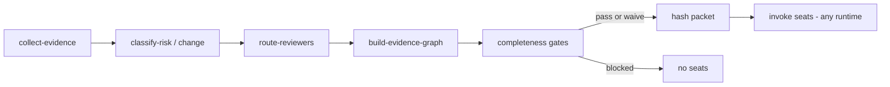

### What it contains (nodes and edges)

Every reviewer sees the same bounded impact graph - symbols, callers, callees, tests,
and cross-repo consumers - not a flat file list.

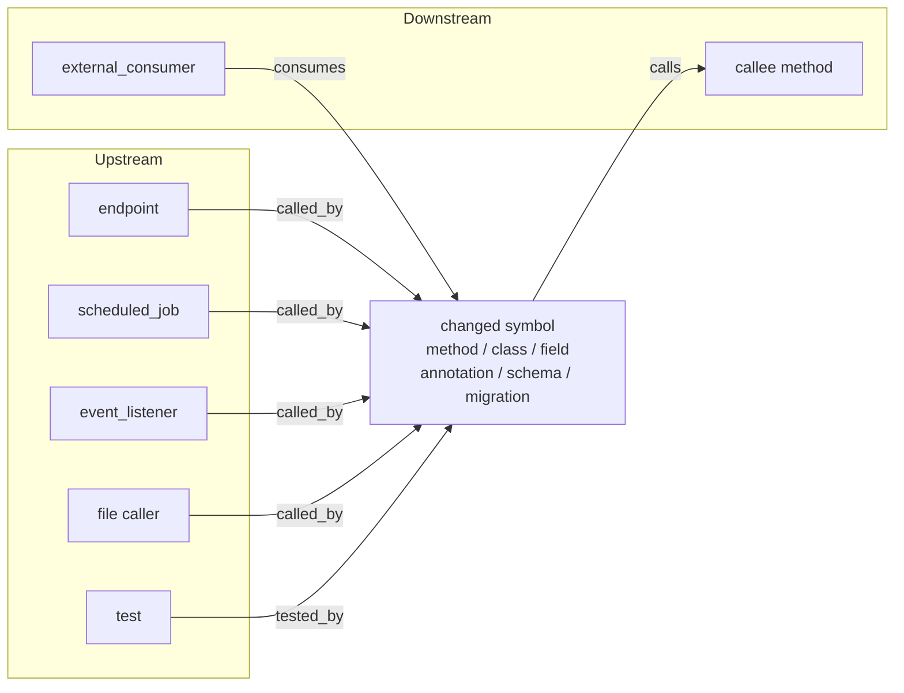

| Edges | Meaning |
|-------|---------|
| `called_by` | Who can reach this change (ripgrep + Spring classify) |
| `calls` | What the change invokes (bounded hops by risk band) |
| `tested_by` | Tests that reference the symbol |
| `consumes` | Exact session co-collected or Index match of api/event/contract consumer |

Categories (each `covered` / `not_applicable` / `unresolved`): changed_symbols,
upstream_entry_points, inbound_callers, outbound_dependencies, framework_reachability,
contracts, persistence, events_and_messages, remote_services, security_and_permissions,
configuration, deployment_and_compatibility, tests, cross_repository_consumers,
operational_side_effects.

Artifacts: `evidence/evidence-graph.json`, `evidence/graph-completeness.json`,
`evidence/evidence-graph-report.md`. Packet sections pin the report into the hash.

Not a reviewer stage and not a graph *runtime*. Full ontology + cross-repo rules:
[`docs/EVIDENCE-GRAPH.md`](docs/EVIDENCE-GRAPH.md).

## 25. Execution profiles and OpenCode Go

Profiles decide **where** each seat runs. They do not change Packet, Evidence Graph,
risk band, or three-axis outcome semantics.

**Recommended:** `cursor-opencode-go` - Cursor subscription for Chair/Shanks +
[OpenCode Go](https://opencode.ai/docs/go/) for Blackbeard/Buggy/Luffy.

| Profile | Role |
|---------|------|
| `cursor-opencode-go` | **Recommended.** Best cost/quality for frequent Yonko |
| `cursor-standard` | Fallback if Go is unavailable |
| `cursor-max` | Premium Cursor-only (manual) |

Why recommended: Go seats do not burn Cursor external-API credits. Go is **$10/mo**
(first month $5) with **$12 / 5h**, **$30 / week**, **$60 / month** included usage.
DeepSeek V4 **Flash** (default Blackbeard) + Luna + Qwen (Luffy) are cheap enough for **many**
medium councils per 5h window; keep Luffy escalation-only. Optional panel edits:
Blackbeard → DeepSeek V4 **Pro** for peak depth; Luffy → Kimi only if you accept slower / costlier runs.

### OpenCode seating (named Cursor tiles)

OpenCode reviews the packet; Cursor Tasks provide visibility:

1. `scripts/seat-council.sh --session … --prepare` → `council.json` with OpenCode-first
   `task_spawn_order`
2. Same Chair turn: spawn **all OpenCode wrappers first** (`run_in_background: true`), then
   Cursor seats. Each wrapper's **first** tool call is Shell of `dispatch.execute_command`
3. ~20s watchdog: any OpenCode `never_started` → re-spawn or
   `seat-council.sh --execute-awaiting`
4. Never pipe `--execute` through `head`/`tail`; never Edit/Write from seats

Cursor badge still shows Composer/Grok for wrappers. Real OpenCode model is in the tile
title + freeze + `result.json`. If Shell asks Allow, that is Cursor auto-run - not Yonko.

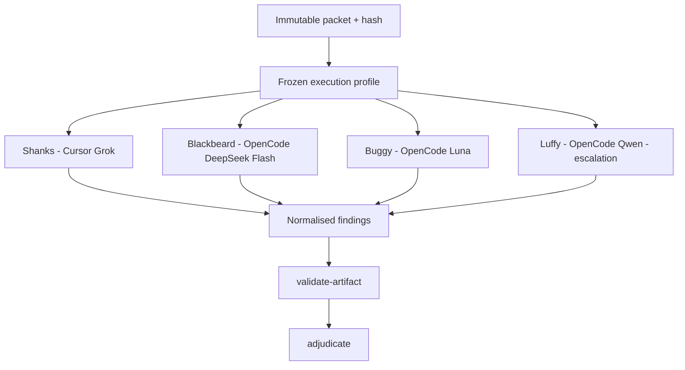

```bash
scripts/set-execution-profile.sh --profile cursor-opencode-go
scripts/yonko-doctor.sh
```

Detail: [`docs/EXECUTION-PROFILES.md`](docs/EXECUTION-PROFILES.md),
[`docs/providers/OPENCODE-GO.md`](docs/providers/OPENCODE-GO.md).

## 26. Evidence vs execution separation

Hard separation (do not collapse these layers):

| Layer | Owns | Must not |
|-------|------|----------|
| Evidence Graph + Index | What must be reviewed; completeness | Choose runtimes / models |
| Packet hash | Immutable review surface | Change after seating starts |
| Execution profile | Which runtime/model reviews the packet | Rebuild graph or rewrite completeness |

Regression: `scripts/test-packet-profile-invariance-smoke.py` - same `packet_hash` and
same completeness status for Cursor and OpenCode under a hybrid profile.

Contract: [`docs/EVIDENCE-EXECUTION-SEPARATION.md`](docs/EVIDENCE-EXECUTION-SEPARATION.md).

## 27. Prompt prefix stability

Adapters build reviewer prompts with a **stable shared prefix** first (protocol →
Packet → finding schema), then seat / repair content. Same Packet + schema → same
`sharedPrefixHash` across seats. Provider prompt-cache hits are observational only.

Detail: [`docs/PROMPT-PREFIX-STABILITY.md`](docs/PROMPT-PREFIX-STABILITY.md).
Smoke: `scripts/test-prompt-prefix-stability-smoke.py`.

## Related documents

| File | Purpose |
|------|---------|
| `SKILL.md` | Agent runtime truth |
| `README.md` / `SHARE.md` | Entry / install |
| `ARCHITECTURE.md` | Mechanical design |
| `CHANGELOG.md` | Version deltas |
| `ENGINEERING-PATTERNS.md` | Harness / protocol-graph / loop diagrams |
| `docs/INVARIANTS.md` | Protocol freeze |
| `docs/EVIDENCE-GRAPH.md` | Impact graph nodes/edges (SoT) |
| `docs/EXECUTION-PROFILES.md` | Runtime profiles (SoT) |
| `docs/providers/OPENCODE-GO.md` | OpenCode setup |
| `docs/EVIDENCE-EXECUTION-SEPARATION.md` | Packet vs runtime contract |
| `docs/PROMPT-PREFIX-STABILITY.md` | Cache-friendly prompt ordering |
| `V4.md` | Observe → measure → understand → optimise (no auto-tune) |
| `MIGRATION.md` | Breaking `/yonko plan` rename; greenfield → SHARE |
| `config/review-types.yaml` | Per-type adapters |
| `config/document-adapters.yaml` | PAP / PRD / ADR / design checklists |

