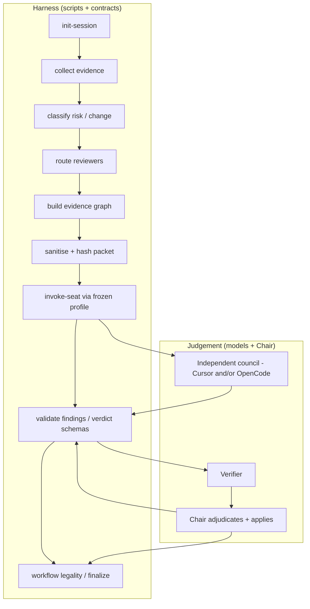
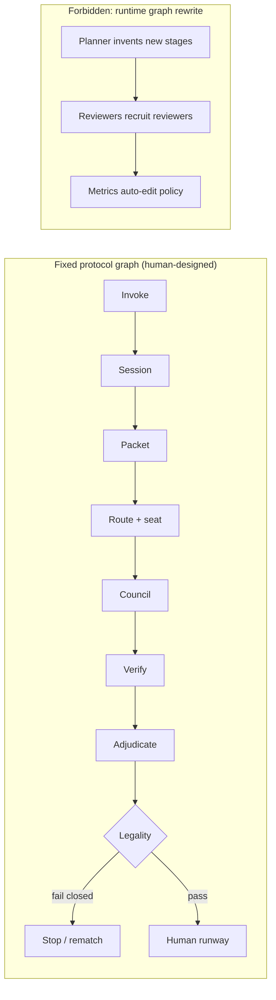
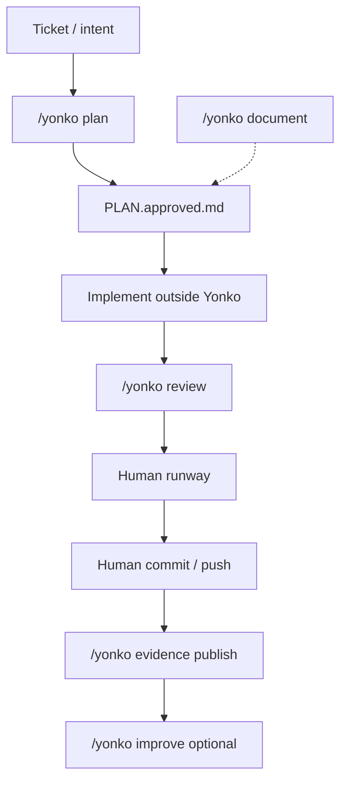
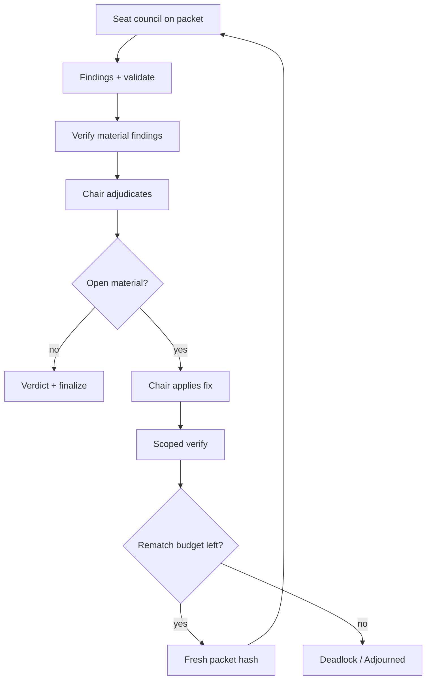
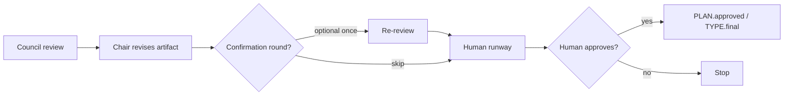
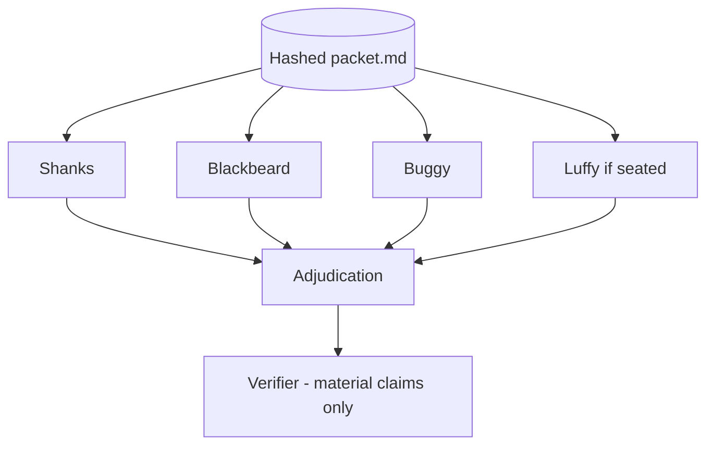
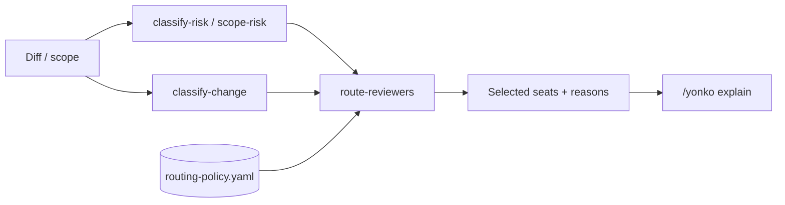
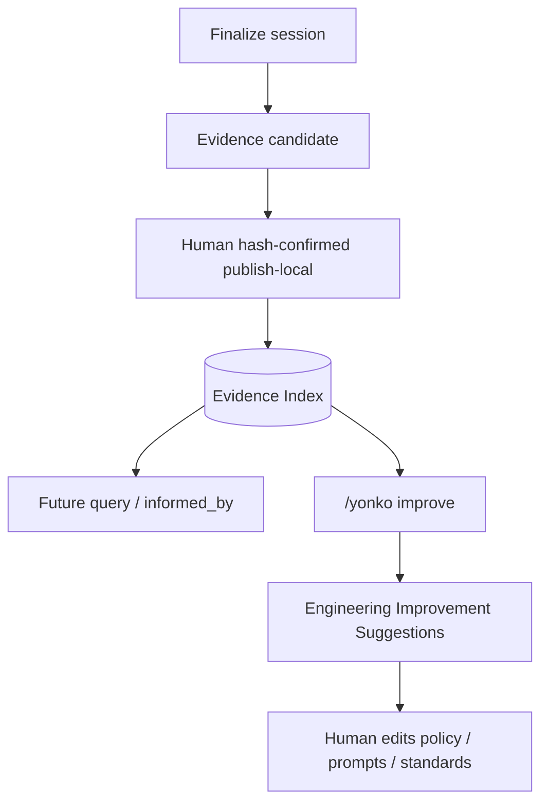
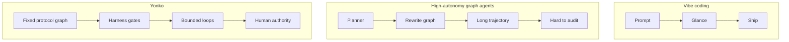

# Engineering patterns in Yonko

> How Yonko uses **harness**, **protocol-graph**, and **loop** engineering -
> and what it deliberately refuses.

Yonko is not "more prompts." It is a **counter to vibe coding**: standards and
guardrails stacked so models can judge while scripts and humans still own process.

```text
Protocol governs process.
Evidence governs decisions.
```

---

## Map: which discipline owns what

| Discipline | What we build | Owner | Not this |
|------------|---------------|-------|----------|
| **Harness engineering** | Scripts, contracts, hashes, exit codes around model judgement | `scripts/` + `contracts/` | Trusting the model to self-enforce legality |
| **Protocol-graph engineering** | A **fixed** control-flow graph of stages (init → packet → seat → review → verify → finalize) | `SKILL.md` + workflow scripts | A runtime that invents new graphs mid-session |
| **Loop engineering** | Bounded rematch / confirmation loops with budgets | `review-types.yaml` + risk budgets | Unbounded "keep going until it feels done" |
| **Packet engineering** | One hashed evidence packet for every seat | collect + sanitise scripts | Different pastes per model |
| **Routing / policy engineering** | Deterministic seat selection from risk + change classes | `routing-policy.yaml` | AI inventing seats |
| **Governance / legality** | Fail-closed session completeness | `workflow/` + `workflow-policy.yaml` | Prompt-only "please don't rubber-stamp" |
| **Knowledge loop** | Evidence Index + suggest-only continuous improvement | evidence + CI scripts | Auto-rewriting the constitution from metrics |

---

## 1. Harness engineering

Models discover. The harness refuses to pretend they also enforce.



**What the harness guarantees**

- Packet hash / pin freshness
- Evidence Graph completeness (or explicit human waiver) before seating
- Finding and verdict shape
- Seating floors and verifier requirements (when legality enforce mode is on)
- Frozen execution profile + model-selection resolution (fail closed)
- Secret scrub and path fences
- Finalize only when procedural gates pass

**What the harness does not guarantee**

- That a finding is *right*
- That the Chair's fix is *complete*
- That shipping is *safe*

Those remain engineering judgement + human authority.

Evidence Graph (impact map, not the protocol graph): nodes = changed symbols +
callers/callees/tests/consumers; edges = `called_by` / `calls` / `tested_by` / `consumes`.
See [`docs/EVIDENCE-GRAPH.md`](docs/EVIDENCE-GRAPH.md).

---

## 2. Protocol-graph engineering (fixed graph, not a graph runtime)

Yonko **does** graph engineering: stages, edges, and fail-closed gates are designed as a
control-flow graph.

Yonko **does not** run a graph *engine* that rewrites that graph at runtime.



| | Fixed protocol graph (Yonko) | Dynamic agent graph (refused) |
|--|------------------------------|-------------------------------|
| Who designs stages | Humans in skill + scripts | Model mid-flight |
| Can edges change mid-session? | No (except declared rematch budget) | Yes |
| Auditability | High - same path every time | Low - trajectory drifts |
| Fit for production review | Strong | Weak |

The Chair **walks** the graph. The Chair does not **redraw** it.

---

## 3. Loop engineering

Three nested loops, each with a hard stop.

### Outer: developer lifecycle loop

Humans choose each phase. No fused autopilot from ticket to merge.



### Middle: implementation rematch loop (bounded)

Declared in `config/review-types.yaml`:

```text
review → adjudicate → apply → verify → bounded re-review
```

Budgets scale with risk band (example from policy): trivial 2 … critical 7 rounds.



### Inner: plan / document confirmation loop

At most **one** confirmation round after revise, then human approval. No silent
implementation or publication.



---

## 4. Packet + independence (the fan-out that makes disagreement useful)



Same packet. Parallel seats. No cross-reading before adjudication. Evidence outweighs votes.

Seating count is **dynamic** (risk band + change classes). Force full council with
`/yonko full` when you want every lens.

---

## 5. Routing as policy engineering



AI may add advisory change classes from a **closed enum**. AI never invents seat names.

---

## 6. Knowledge loop (observe → measure → understand → optimise)

Outer institutional loop. Suggest only. Humans still edit protocol.



**Hard rule:** metrics and suggestions never silently rewrite seating, packets, or apply rules.

---

## 7. Contrast: three engineering cultures



| | Vibe | Dynamic graph agents | Yonko |
|--|------|----------------------|-------|
| Loop | Accidental | Often unbounded | Declared + budgeted |
| Graph | None | Runtime-mutable | Fixed + walked |
| Harness | Weak | Mixed | Script-first gates |
| Goal | Speed | Autonomy | Confidence under evidence |

---

## 8. Where to look in the repo

| Pattern | Primary files |
|---------|----------------|
| Harness | `scripts/*.sh`, `scripts/workflow/`, `scripts/lib/runtime/`, `contracts/` |
| Protocol graph | `SKILL.md`, `ARCHITECTURE.md`, `config/workflow-policy.yaml` |
| Loop shapes | `config/review-types.yaml` (`loop`, budgets, confirmation rounds) |
| Routing | `config/routing-policy.yaml`, `scripts/lib/routing.py` |
| Packet | `sanitise-and-hash-packet.sh`, `templates/docket-and-packet.md` |
| Knowledge loop | `scripts/evidence-index.py`, `scripts/continuous-improvement.py` |
| Philosophy | `V4.md` (observe → measure → understand → optimise) |

---

## One-liner

**Harness wraps judgement. A fixed protocol graph sequences work. Bounded loops rematch until evidence or budget ends. Humans own commits and constitution.**
