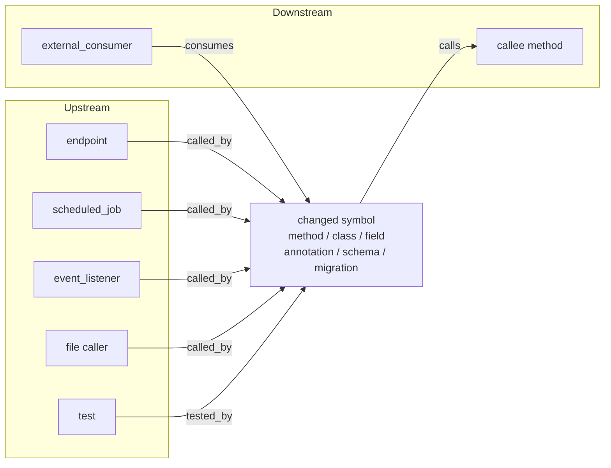

# Evidence Graph v1

Deterministic change-impact evidence between routing and packet hash.

## Purpose

Give every reviewer the same bounded map of:

- what changed (symbols, not only files)
- what can reach it (upstream / framework edges)
- what it can affect (downstream / persistence / events / remote)
- contracts, security, config, tests
- unresolved edges (especially cross-repo consumers)
- category completeness: `covered` | `not_applicable` | `unresolved`

This is **not** a new reviewer stage and **not** a graph runtime.
Models interpret; scripts own edges.


## Shape (nodes and edges)

What reviewers get pinned into the packet is a real graph, not a file list.



### Node types (v1)

| Type | How it appears |
|------|----------------|
| `method` / `method_body` / `class` / `field` | Diff symbol extract |
| `annotation` | Annotation lines in the diff |
| `schema` / `config_key` / `migration` | Path heuristics (OpenAPI, config, Flyway) |
| `endpoint` / `scheduled_job` / `event_listener` / `file` | Ripgrep callers classified by Spring annotations |
| `test` | Test path referencing a changed symbol |
| `external_consumer` | Session co-collected signal match, or Evidence Index exact api/event/contract match |

### Edge types (v1)

| Type | Direction | Discovery |
|------|-----------|-----------|
| `called_by` | caller → changed symbol | ripgrep + Spring classify |
| `calls` | changed symbol → callee | source scan (bounded hops by risk band) |
| `tested_by` | test → changed symbol | ripgrep on test paths |
| `consumes` | external_consumer → producer | Session co-collected exact signal match, else Evidence Index exact match |

Unresolved material edges stay in `unresolved_edges` - they are not dropped to look complete.

### Completeness categories

Every category is `covered` | `not_applicable` | `unresolved`:

```text
changed_symbols · upstream_entry_points · inbound_callers · outbound_dependencies
framework_reachability · contracts · persistence · events_and_messages
remote_services · security_and_permissions · configuration
deployment_and_compatibility · tests · cross_repository_consumers
operational_side_effects
```

Band-scaled depth: `config/evidence-graph/policy.json` → `depth_by_band` (upstream/downstream hops).
Gates: `config/evidence-graph/completeness-gates.json` (may block seating or complete verdict).

## Flow

```text
collect-evidence → classify-risk → classify-change → route-reviewers
  → build-evidence-graph (local + session co-collected consumers + Index exact match)
  → evaluate completeness
  → sanitise-and-hash-packet
  → resolve execution profile
  → seat reviewers (any runtime; same packet)
  → validate findings
  → three-axis outcome
```

Evidence Graph owns *what* must be reviewed. Execution profile owns *which*
runtime/model reviews the hashed packet. See `EVIDENCE-EXECUTION-SEPARATION.md`.

## Commands

```bash
scripts/build-evidence-graph.sh --session "$SESSION"
# seating blocked:
scripts/build-evidence-graph.sh --session "$SESSION" \
  --waive --waive-reason "..." --approved-by "human"
```

Artifacts:

- `evidence/evidence-graph.json`
- `evidence/graph-completeness.json`
- `evidence/evidence-graph-report.md`

Packet sections (implementation): `EVIDENCE GRAPH`, `EVIDENCE COMPLETENESS`, `EVIDENCE GRAPH REPORT`.

## Config

- `config/evidence-graph/policy.json` (+ `.yaml`)
- `config/evidence-graph/completeness-gates.json`
- `config/evidence-graph/stopping-rules.json`
- `config/evidence-graph/java-spring-adapters.json`

Risk band is **read** from `evidence/risk.json` (or scope-risk). Gates never rewrite risk or seating.

## Deterministic vs model

| Scripts own | Models may |
|-------------|------------|
| Diff symbol extract, rg callers, Spring annotation scan, path heuristics, completeness status | Interpret meaning, attack paths, suggest edges to verify |

Model-suggested edges must be verified deterministically, marked inferred/unresolved, or rejected.

## Supported patterns (v1)

Java/Spring first: method/class/field/annotation diffs, `@RestController` / mappings / `@Scheduled` / listeners / `@Transactional` / `@PreAuthorize`, Flyway paths, config keys, test name hits via ripgrep.

## Blind spots

- No full type-resolved call graph / LSP
- Non-Java mostly file-level + unresolved categories
- Cross-repo consumers stay `unresolved` when neither session co-collected repos nor
  the Evidence Index prove an exact api/event/contract match (see below)
- Semantic-only changes (same type, new meaning) are not proven edges
- Permission-name (`hasAuthority`) hits are candidates only - not covered edges

## Adding an adapter

Edit `java-spring-adapters.json` annotation lists / path signals. Keep discovery in `scripts/lib/evidence_graph/build.py` collectors.

## Cross-repository consumers

Resolution order (exact structural matches only). Fuzzy text overlap is a
**candidate**, never `covered`. Attaching a second `--repo` without signal overlap
does **not** resolve.

### 1. Session co-collected repos (preferred for multi-repo packets)

When `collect-evidence` attached other repositories in this session, the graph
searches each sibling's patch and working tree for the producer's api / event /
contract signals. Exact substring / fixed-string ripgrep hits become
`consumes` edges with discovery method `session_co_collected_signal_match`.

This is how paired multi-repo reviews (producer + real consumer in one packet) mark
`cross_repository_consumers` **covered** without waiting on Evidence Index publish.

### 2. Evidence Index (fallback / institutional memory)

| Producer signal | Match field on Index record | Relationship |
|-----------------|----------------------------|--------------|
| `/vN/...` or `@*Mapping` path | `apis[]` | `api_consumer` |
| `*Event` / `sns|sqs|kafka:...` | `events[]` | `event_consumer` |
| `*-model` | `contracts[]` | `shared_library_consumer` |
| `hasAuthority('…')` | claim/title text only | **candidate** (no typed permissions field yet) |

Statuses:

- `resolved` - session sibling or Index record shares exact api/event/contract; edge type `consumes`
- `unresolved` - consumer-relevant signals present, no exact outside consumer (gap retained)
- `not_applicable` - change has no cross-repo producer signals

**Not treated as cross-repo producer signals** (no in-repo code consumer to prove):

- CloudFormation / alarms / terraform / helm / deploy / GitHub workflow paths
- Logging framework type names (`ILoggingEvent`, etc.)

Those map to `operational_side_effects` / `deployment_and_compatibility` instead.
After filtering, empty producer signals → `not_applicable`, not a material unresolved gap.

Resolved consumer records include: repository, relationship type, evidence_id,
compatibility evidence, last-seen revision (Index), whether deployment order is known
(`deployment_type` / `rollout_strategy`, or `co_collected_in_session`).

Index path requires `YONKO_EVIDENCE_REPO` with published records. Graph build uses the
canonical checkout (`prefer_cache=False`) for Index determinism. Session resolution
does not require the Index.

## Complete vs incomplete (do not collapse)

Evidence completeness is **not** the review verdict.

| Axis | Values | Meaning |
|------|--------|---------|
| `review_outcome` | `pass` \| `findings` \| `inconclusive` | Validated defects only |
| `evidence_completeness` | `complete` \| `incomplete` | Whether the impact graph covered material paths |
| `deployment_recommendation` | `proceed` \| `proceed_with_caveat` \| `block` | Ship advice from both axes |

Example that must stay distinct:

```text
Review outcome: pass - No validated defects found
Evidence completeness: incomplete - external consumers unresolved
Deployment recommendation: proceed_with_caveat
```

Never report that as sole `PASS` or sole `FAIL`.

`finalize-session.sh` writes `outcome.json` plus the same fields on `metrics.json` / `SUMMARY.md`.
Legacy protocol `verdict` (`pass`/`remand`/…) remains for workflow compatibility.

`blocks_complete_verdict` in `graph-completeness.json` forces `evidence_completeness=incomplete`.
Seating may still proceed when `ok_for_seating` is true.

## Next increment

Deeper LSP / type-resolved call graphs only if evidence shows the current
ripgrep + Spring adapters are insufficient. Cross-repo Index resolution shipped in
3.8.0; session co-collected consumer resolution in 3.9.1.

