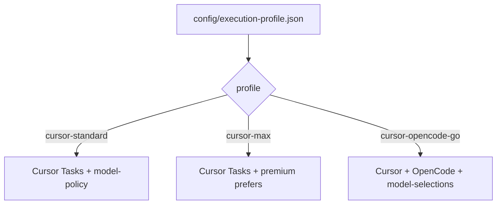

# Execution profiles

Yonko owns the review protocol, evidence, validation, and verdict.
**Execution profiles** only decide which runtime and model perform each independent seat.

```text
seat → execution profile → model-selections panel → runtime adapter → model invocation
    → normalised result → existing validation → existing verification / adjudication
```

Profile choice and risk routing are independent:

| Concern | Owner |
|---------|--------|
| Profile | where / how seats execute |
| Risk band | how many seats and which escalation rules apply |
| Model IDs | `config/model-selections.json` (single source of truth) |

## Profiles




| Profile | Status | Runtimes | Notes |
|---------|--------|----------|-------|
| `cursor-opencode-go` | **recommended** | Cursor + [OpenCode Go](https://opencode.ai/docs/go/) | Best cost/quality for frequent Yonko. Models from `model-selections.json`. Status in profile JSON remains `experimental` until real-ticket measurement graduates it. |
| `cursor-standard` | stable (fallback) | Cursor only | No OpenCode required. Uses `model-policy.yaml`. |
| `cursor-max` | stable | Cursor only | Premium Cursor prefers. Higher cost. Manual only. |

### Recommended: `cursor-opencode-go`

**Why:** Cursor subscription runs Chair + Shanks. OpenCode Go runs Blackbeard / Buggy / Luffy
on strong coding models **without** burning Cursor external-API credits. Every seat
starts from the same hashed packet. OpenCode seats may then use frozen, logged,
read-only workspace discovery. You get multi-provider review at Go's subscription economics.

OpenCode Go (upstream, [docs](https://opencode.ai/docs/go/)): **$5 first month, then $10/month**.
Included usage windows (dollar value; request count depends on model):

| Window | Included usage |
|--------|----------------|
| 5 hours | $12 |
| Weekly | $30 |
| Monthly | $60 |

Rough capacity on the recommended panel (official Go request estimates; Yonko seats use larger
packets so treat as order-of-magnitude):

| Model (seat) | Est. requests / 5h | Est. / month |
|--------------|--------------------|--------------|
| DeepSeek V4 Flash (Blackbeard) | higher than Pro (speed default) | higher than Pro |
| GPT-5.6 Luna (Buggy) | ~2,050 | ~10,250 |
| Qwen 3.7 Plus (Luffy, escalation) | higher than Kimi (default Luffy) | higher than Kimi |
| Kimi K3 (`luffy_kimi` alternate) | ~110 | ~490 |

A medium Yonko round without Luffy typically burns **cents** of Go usage (live hybrid runs
were often well under $0.05 for Blackbeard+Buggy). That means **many** council rounds per
5-hour window. Seat Luffy only when routing requires him. Prefer default Qwen for Luffy;
optional Kimi is the expensive / historically slow seat.

Setup: [`docs/providers/OPENCODE-GO.md`](providers/OPENCODE-GO.md).

### `cursor-opencode-go` seat ladder

Risk routing still decides *whether* a seat sits. When seated:

```text
Chair      → Cursor Auto           (Cursor)     # orchestration; variable
Shanks     → Grok                  (Cursor)     # never Auto
Blackbeard → DeepSeek V4 Flash     (OpenCode Go) # correctness (speed default)
Buggy      → GPT-5.6 Luna          (OpenCode Go) # GPT-family chaos / omitted cases
Luffy      → Qwen 3.7 Plus         (OpenCode Go) # escalation only (high/critical / /yonko full)
```

Optional alternates (edit `config/model-selections.json` only - no runtime auto-switch):

- Blackbeard → DeepSeek V4 Pro (peak SWE depth when Flash is too shallow)
- Luffy → Kimi K3 (`luffy_kimi`; historically timed out at 600s on plan packets)

No separate Remand→Opus/Sol ladder on this profile. Missing model IDs fail closed.

**Recommended marker:** `cursor-opencode-go` (set after Go auth + `/yonko doctor` green).

**Resolution fallback:** missing marker or missing `executionProfile` key → `cursor-standard`
(so clones without OpenCode still boot). Not an automatic migration away from a set marker.

## Marker

Active profile file:

`config/execution-profile.json`

```json
{
  "schema_version": 1,
  "executionProfile": "cursor-opencode-go"
}
```

Switch:

```bash
scripts/set-execution-profile.sh --profile cursor-opencode-go
scripts/set-execution-profile.sh --profile cursor-standard
```

Or edit the marker directly. Definitions live in `config/execution-profiles/*.json`.
Model IDs: `config/model-selections.json`.
Schema: `contracts/execution-profile.schema.json`, `contracts/model-selections.schema.json`.

## Session freeze

On `init-session.sh`, the active profile is validated and **frozen** into `session.json` / `evidence/execution-profile.json`:

- profile id + fingerprint
- model-selection panel + version
- runtime per seat
- configured model + resolved model per seat

If the global marker or model-selections file changes mid-session, the in-flight session keeps its freeze.
Do not store credentials in the freeze.

## Runtime contract

Dispatcher: `scripts/invoke-seat.sh` → `scripts/lib/runtime/invoke_seat.py`

Adapters receive already-resolved model IDs. They never choose substitutes.

### Cursor Task visibility (required for OpenCode)

OpenCode seats default to **dispatch only** (`awaiting_chair_dispatch`,
`dispatch_mode=cursor_task_wrapper`). Chair must spawn one Cursor Task per seat
(description from `dispatch.task_description`) that runs:

```bash
scripts/invoke-seat.sh --session DIR --seat SEAT --execute
```

That gives the same named-tile tracking as Cursor seats (e.g. Shanks) while OpenCode
still performs the review. Chair must not background `--execute` from the parent turn.

Observability (`runtime/<seat>/result.json`):

- seat, runtime
- model_configured, model_resolved, model_actual (actual only when known)
- duration_ms, attempts, failure_category, schema_valid, skipped, completed, usage
- `prompt` (optional): shared/full prompt hashes, bytes, provider cache metrics

Reviewer prompts use a stable shared prefix (protocol → Packet → schema) then seat /
repair suffixes. See [`PROMPT-PREFIX-STABILITY.md`](PROMPT-PREFIX-STABILITY.md).

For Cursor Auto: `configured=auto`, `resolved=auto`, `actual` only if Cursor exposes it.

After a Cursor Task seat returns, Chair must run `scripts/record-cursor-seat.sh` so
`started_at` / `ended_at` / `duration_ms` are populated (dispatch alone leaves
`duration_ms=0` and `awaiting_chair_dispatch=true`).

Seat findings envelopes require top-level `disposition` (`Remand`|`Content`) -
enforced by `validate-artifact.sh --kind findings`.

## Doctor

```bash
scripts/yonko-doctor.sh --profile cursor-opencode-go
```

Checks execution profile, Cursor Auto, Grok, OpenCode install/auth, panel model resolve, Packet/Profile invariance harness, Ready. Never paid inference; never rewrites model IDs; never prints credentials.

## Invariance

Packet hash and Evidence Graph are independent of profile/model selection. Changing
models or repository exploration mode must not change Packet contents. Discovery is
recorded separately and produces suggest-only graph-gap candidates. See
`scripts/test-packet-profile-invariance-smoke.py`.
