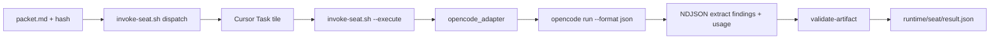

# OpenCode Go (Yonko external reviewer runtime)

**Recommended Yonko execution path** when you have Cursor + [OpenCode Go](https://opencode.ai/docs/go/).

OpenCode is **not** part of Cursor's native Agent panel.
Yonko invokes it as a **separate runtime** while you work in the same repository
(usually from Cursor's integrated terminal, or via `scripts/invoke-seat.sh`).

Cursor remains the IDE and Chair / orchestrator (Auto + Grok for Chair/Shanks).
OpenCode Go runs Blackbeard / Buggy / Luffy: same immutable hashed Packet,
independent process per seat, packet-anchored read-only repository exploration,
findings only, no repository writes, no commit/push.

### Why this is the recommended route

| Concern | Hybrid (`cursor-opencode-go`) |
|---------|-------------------------------|
| Cost | Go is **$10/mo** (first month $5) with **$12 / 5h**, **$30 / week**, **$60 / month** included usage ([upstream](https://opencode.ai/docs/go/)) |
| Cursor credits | Grind seats do not consume Cursor external-API quota |
| Quality | DeepSeek V4 Flash (correctness, speed) + Luna (GPT-family) + Qwen (Luffy escalation) on one packet |
| Volume | Medium rounds without Luffy are typically cents of Go usage → many Yonko runs per 5h window |

Full profile notes: [`docs/EXECUTION-PROFILES.md`](../EXECUTION-PROFILES.md).

## Hybrid path



Chair stays in Cursor. Each OpenCode seat is a **Cursor Task wrapper** (named tile like
`Blackbeard Yonko review`) that only Shell-runs `--execute`. OpenCode is still the
reviewer; the wrapper model does not re-review the packet. OpenCode never becomes the writer.

## What you need

1. OpenCode CLI installed and on `PATH` (`opencode --version`).
2. OpenCode Go subscription / authentication via OpenCode's supported flow.
3. Model ids verified with `opencode models` (do not guess).
4. Yonko profile marker set to `cursor-opencode-go`.
5. `/yonko doctor` green for that profile.

## Install OpenCode

Follow current upstream docs: [https://opencode.ai/docs/cli/](https://opencode.ai/docs/cli/)

Typical install methods (curl / npm / brew) change over time - use the official page.

## Authenticate (OpenCode Go)

Do **not** commit API keys or paste them into the Yonko repo.

1. Create / sign in to your OpenCode account and subscribe to Go if required:
   [https://opencode.ai/docs/go/](https://opencode.ai/docs/go/)
2. In OpenCode TUI: `/connect` (or CLI: `opencode auth login`) and select **OpenCode Go**.
3. Paste the key when prompted. Credentials live in the OpenCode local auth store
   (commonly under `~/.local/share/opencode/` - Yonko never reads or prints that file's contents).
4. Confirm without secrets:

```bash
opencode auth list
```

Yonko doctor only reports whether authentication appears available - never secret values.

## List models and resolve ids

```bash
opencode models
opencode models --refresh   # network; optional
```

Ids are typically `provider/model`. Confirm with `opencode models` on your machine.
Default panel IDs live only in `config/model-selections.json` (do not hardcode elsewhere).

Yonko profile `cursor-opencode-go` ladder (when seated by risk routing):

| Seat | Runtime | Model id (pinned) |
|------|---------|-------------------|
| Chair | Cursor | `auto` (orchestration; variable) |
| Shanks | Cursor | `grok` |
| Blackbeard | OpenCode Go | `opencode-go/deepseek-v4-flash` |
| Buggy | OpenCode Go | `opencode-go/gpt-5.6-luna` |
| Luffy (escalation only) | OpenCode Go | `opencode-go/qwen3.7-plus` |

Optional edits in `model-selections.json` only (no runtime auto-switch):

- Blackbeard → `opencode-go/deepseek-v4-pro` (peak SWE depth when Flash is too shallow)
- Luffy → `opencode-go/kimi-k3` (`luffy_kimi` alternate; historically timed out at 600s on plan packets)

Default OpenCode seats stay on three providers: DeepSeek (Blackbeard) · OpenAI/Luna (Buggy) · Qwen (Luffy).

Missing or ambiguous models **fail closed** - never silently substitute Flash for Pro, or another seat's model for Luffy.

OpenCode Go does not consume Cursor external API credits.

## Select the profile

```bash
scripts/set-execution-profile.sh --profile cursor-opencode-go
```

Or:

```json
{
  "schema_version": 1,
  "executionProfile": "cursor-opencode-go"
}
```

in `config/execution-profile.json`.

Return to Cursor-only fallback:

```bash
scripts/set-execution-profile.sh --profile cursor-standard
```

## Doctor

```bash
scripts/yonko-doctor.sh
# or
scripts/yonko-doctor.sh --profile cursor-opencode-go --json
```

Slash: `/yonko doctor`

## Seat behaviour

- Fresh OpenCode session per seat (no `--continue` / shared session).
- Prefer returning findings JSON on stdout. Adapter writes session artefacts under `SESSION/runtime/<seat>/`.
- With `--format json`, OpenCode emits an NDJSON event stream. Findings usually land in a late
  `type=text` event at `part.text` (plain JSON or a ```json fence). The adapter walks that stream
  (`extract_findings_from_opencode_stdout`); a whole-stdout brace walk is not enough because
  earlier `tool_use` events contain large nested JSON without a findings array.
- Cost/tokens come from `step_finish` events (`part.cost`, `part.tokens`) and are aggregated into
  `runtime/<seat>/result.json` → `usage` (`extract_usage_from_opencode_stdout`).
- CLI argv: positional message **before** `--file` (OpenCode 1.18.x treats the prompt as a filename if `--file` comes first).
- The seat prompt is **attached** (`--file runtime/<seat>/prompt.txt`), not passed as an argument.
  The positional message is a short pointer to that attachment. Windows `CreateProcess` rejects
  command lines over 32767 characters and real prompts run 20-130 KB, so argv delivery fails there
  with `OSError [WinError 206]`. `run_opencode` also refuses over-long argv on Windows with
  `argv_too_long` rather than letting the operating system raise a confusing filename error.
  `prompt.txt` content, `prompt.meta.json` hashes, and prefix ordering are unchanged.
- Live review mode is `packet_plus_workspace_read`. The Packet stays authoritative.
  The seat can use read, glob, grep, list, Language Server Protocol (LSP), and
  tightly allow-listed read-only Git commands across declared repositories.
- `OPENCODE_PERMISSION` and the `yonko-reviewer` agent deny edits, writes,
  subagents, network tools, arbitrary shell, and sensitive paths. Yonko never
  invokes OpenCode with `--auto`.
- Risk-band budgets cap duration and fail the seat if observed file, search, LSP,
  or byte use exceeds the frozen budget.
- `runtime/<seat>/repository-exploration.json` records files, searches, LSP
  lookups, budget use, and truncation. Finalization emits suggest-only Evidence
  Graph gap candidates.
- Frozen-packet replay forces `packet_only`. Full-pipeline replay and normal live
  review use `packet_plus_workspace_read`.
- **Baseline-delta worktree guard** (not "fail if dirty"):
  1. Snapshot path + content digest before invoke
  2. Invoke OpenCode
  3. Snapshot after
  4. Fail with `permission_violation` only for **new or changed** paths beyond the baseline
  5. Pre-existing user dirt that is unchanged does **not** fail
  6. Allowed writes: session `runtime/` artefacts if the session lives inside the repo, and `.yonko/`
  7. Changes are **not** auto-discarded
- Output treated as untrusted; validated by existing `validate-artifact.sh` (one bounded repair attempt).
- Prompts use stable prefix ordering (protocol → Packet → schema → seat → run). See
  [`docs/PROMPT-PREFIX-STABILITY.md`](../PROMPT-PREFIX-STABILITY.md). Repair keeps the same
  shared-prefix hash and only appends a volatile suffix.
- Logs: `cli.stdout.txt` / `cli.stderr.txt` (secret-redacted). No hidden reasoning in user-facing artefacts.

## Limits and caveats

Upstream Go windows ([opencode.ai/docs/go](https://opencode.ai/docs/go/)): **$12 / 5h**, **$30 / week**, **$60 / month**.
Cheaper models buy more requests. Default Luffy is Qwen (distinct provider). Optional `luffy_kimi`
(Kimi K3, ~110 est. requests / 5h) is expensive and historically timed out at 600s on plan packets.

- Model availability and identifiers may change - confirm with `opencode models`.
- OpenCode cannot always hard-guarantee read-only; Yonko uses a baseline-delta snapshot (path + digest), not `git diff --quiet`. Unchanged pre-existing dirt is allowed.
- No silent substitution of DeepSeek↔Qwen or OpenCode↔Cursor.
- Fallback without Go: `scripts/set-execution-profile.sh --profile cursor-standard`.

## Controlled comparison (manual)

Same Packet, same seat prompt, Cursor-standard model vs OpenCode model:
compare schema adherence, duration, validated findings, runtime failures.
No automatic benchmarking in v1.
